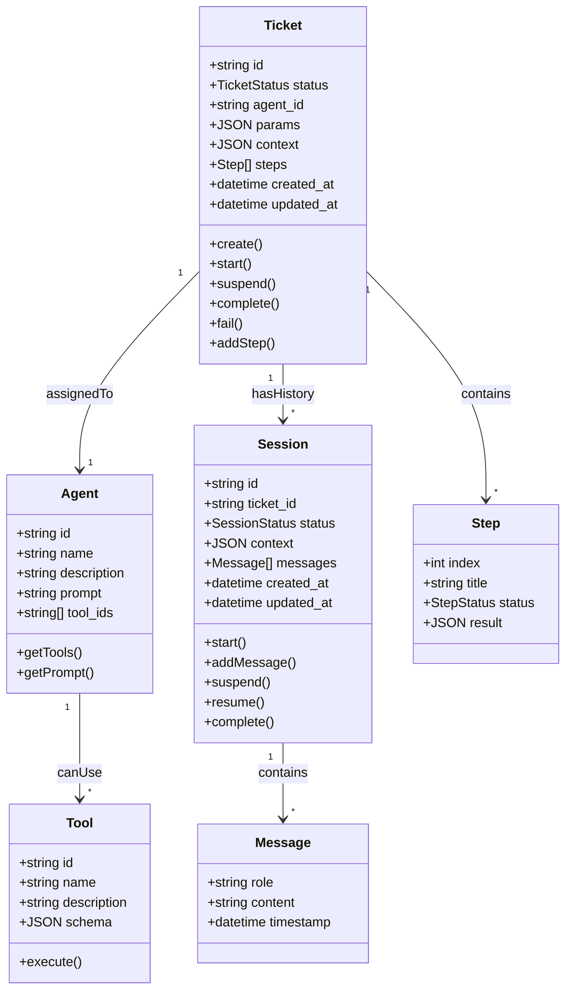
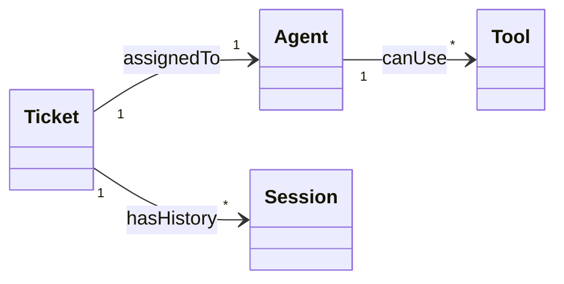

# Agent 平台领域模型分析

## 1. Concept Dictionary

| Term | CN | Definition |
|------|----|------------|
| Agent | 代理 | 任务的执行者，主要的智力推导实体，拥有特定的 prompt 和可调用的 tools |
| Ticket | 工单 | 任务的载体，定义了任务的状态、参数、上下文和子步骤 |
| Session | 会话 | Agent 执行任务时的运行实例，包含状态、上下文和对话历史 |
| Tool | 工具 | Agent 可调用的外部能力，用于完成特定操作 |
| Step | 步骤 | Ticket 的子步骤，由 Agent 动态拆解并更新（嵌入 Ticket） |
| Message | 消息 | Session 中的对话历史记录，包含 Agent 与 LLM 的交互（嵌入 Session） |

---

## 2. Core Concepts

### Ticket (工单)

- **Type**: Aggregate Root
- **Properties**:
  - `id`: string (UUID)
  - `status`: enum (pending | running | suspended | completed | failed)
  - `agent_id`: string (关联的 Agent)
  - `params`: JSON (自由格式，用户输入，Agent 自行解析)
  - `context`: JSON (静态任务定义：目标、约束条件，创建后不可变)
  - `steps`: Step[] (子步骤列表，由 Agent 动态添加)
  - `created_at`, `updated_at`: datetime
- **Behaviors**: create(), start(), suspend(), complete(), fail(), addStep()
- **States**: pending → running → suspended → pending (可循环) / completed / failed

### Agent (代理)

- **Type**: Entity
- **Properties**:
  - `id`: string
  - `name`: string
  - `description`: string
  - `prompt`: string (系统提示词)
  - `tool_ids`: string[] (可用工具列表)
- **Behaviors**: getTools(), getPrompt()
- **States**: (none)

### Session (会话)

- **Type**: Entity
- **Properties**:
  - `id`: string (UUID)
  - `ticket_id`: string (关联的 Ticket)
  - `status`: enum (active | suspended | completed)
  - `context`: JSON (动态运行时状态：中间结果、临时变量)
  - `messages`: Message[] (对话历史)
  - `created_at`, `updated_at`: datetime
- **Behaviors**: start(), addMessage(), suspend(), resume(), complete()
- **States**: active → suspended → active (可循环) / completed

### Tool (工具)

- **Type**: Entity
- **Properties**:
  - `id`: string
  - `name`: string
  - `description`: string
  - `schema`: JSON (输入参数定义)
- **Behaviors**: execute()
- **States**: (none)

### Step (步骤) - 嵌入 Ticket

- **Type**: Value Object
- **Properties**:
  - `index`: int
  - `title`: string
  - `status`: enum (pending | running | completed | failed)
  - `result`: JSON (可选)
- **States**: pending → running → completed / failed

### Message (消息) - 嵌入 Session

- **Type**: Value Object
- **Properties**:
  - `role`: enum (user | assistant | system | tool)
  - `content`: string
  - `timestamp`: datetime
- **States**: (none - immutable)

---

## 3. Class Diagram

---

## 4. Cognitive Dimensionality Reduction

> **Total concepts identified**: 6

> ⚠️ 概念数量超过认知极限 (4)。建议以下合并策略：

1. **将 `Step` 嵌入 `Ticket`**: Step 是 Ticket 的组成部分，没有独立生命周期，可以作为 Ticket 的属性（steps 数组）
2. **将 `Message` 嵌入 `Session`**: Message 是 Session 的组成部分，没有独立生命周期，可以作为 Session 的属性（messages 数组）

**精简后 (4 个核心概念)**:
- `Ticket` (Aggregate Root, 包含 Steps)
- `Agent` (Entity)
- `Session` (Entity, 包含 Messages)
- `Tool` (Entity)

---

## 5. Design Decisions

以下设计决策已在头脑风暴中确认：

### 5.1 Ticket.params

- **决策**: 自由 JSON 格式，用户输入，Agent 自行解析
- **理由**: 保持灵活性，不同 Agent 可定义自己的参数结构

### 5.2 Context 区分

- **Ticket.context**: 静态任务定义（目标、约束条件），创建后不可变
- **Session.context**: 动态运行时状态（中间结果、临时变量），执行过程中更新

### 5.3 人工介入

- **输入类型**: 纯文本
- **界面形式**: 聊天式界面，用户看到 Agent 消息历史，在底部输入框回复
- **理由**: 保持简单，符合用户直觉

### 5.4 初期 Tools

代码操作类：
- `read_file`: 读取文件内容
- `write_file`: 写入文件内容
- `execute_command`: 执行 shell 命令
- `search_code`: 搜索代码（基于 grep/ripgrep）

网络请求类：
- `http_request`: 发送 HTTP 请求
- `fetch_webpage`: 抓取网页内容

### 5.5 主循环调度

- **策略**: 轮询
- **实现**: asyncio 后台任务，定时扫描 pending 状态的 Ticket
- **间隔**: 1-3 秒
- **理由**: SQLite 不支持原生事件通知，轮询实现简单，开销可忽略，未来可平滑迁移到事件驱动

---

## 6. Open Questions

~~- [ ] **Missing**: Ticket 的 `params` 具体包含哪些字段？是否需要定义 schema？~~
~~- [ ] **Missing**: Session 的 `context` 存储什么内容？与 Ticket 的 `context` 有何区别？~~
~~- [ ] **Unclear**: Agent 请求人工介入时，具体需要用户提供什么类型的输入？（文本、选择、文件？）~~
~~- [ ] **Missing**: Tools 初期 hardcode 的具体工具有哪些？需要支持哪些基础能力？~~
~~- [ ] **Unclear**: 主循环 (Main Loop) 的调度策略是什么？轮询？事件驱动？~~
~~- [ ] **Missing**: Session 界面中 "人工介入" 的交互形式是什么？聊天框？表单？~~

✅ 所有问题已解决，见 Section 5: Design Decisions
