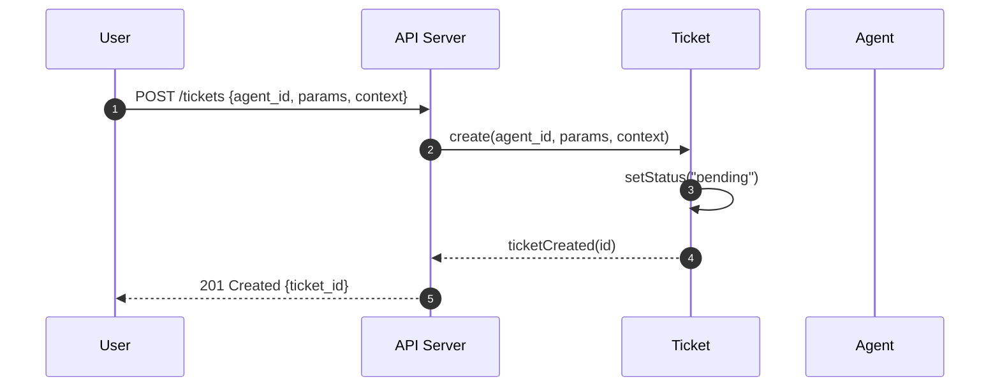
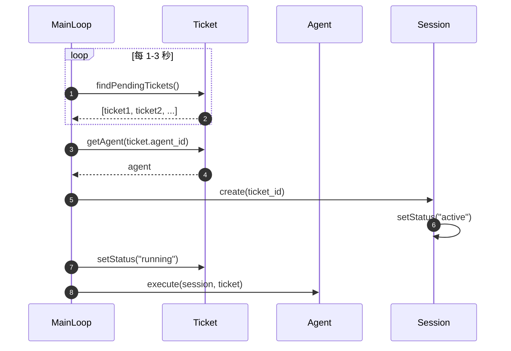
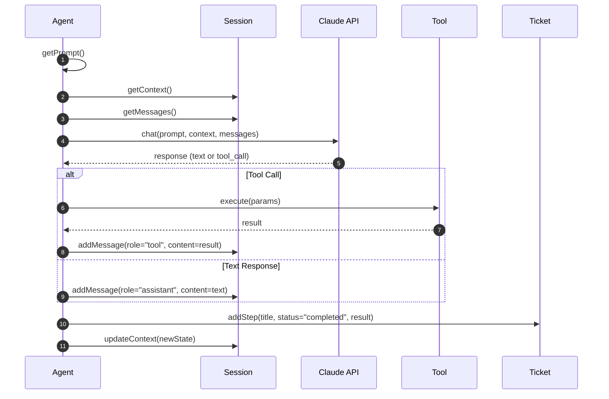
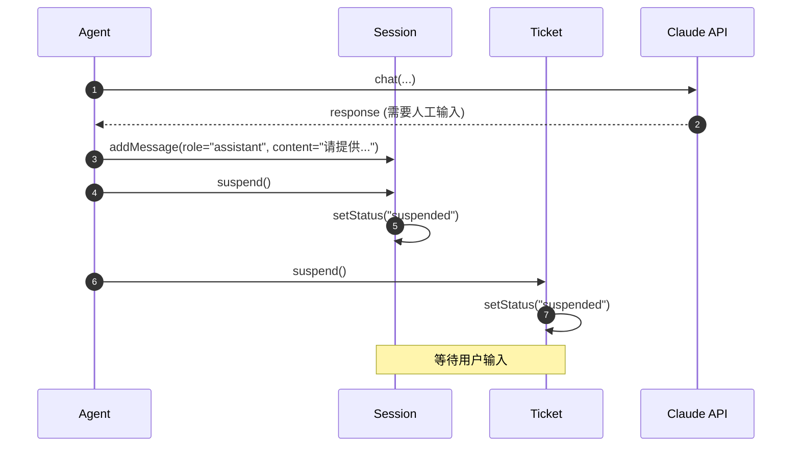
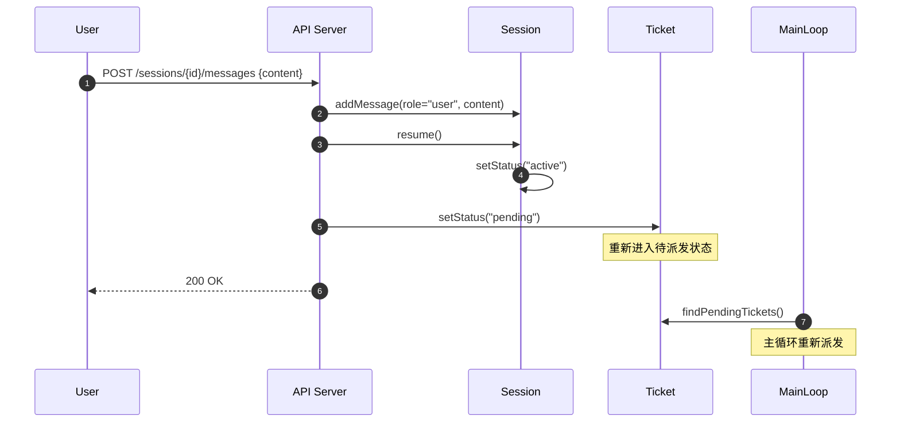
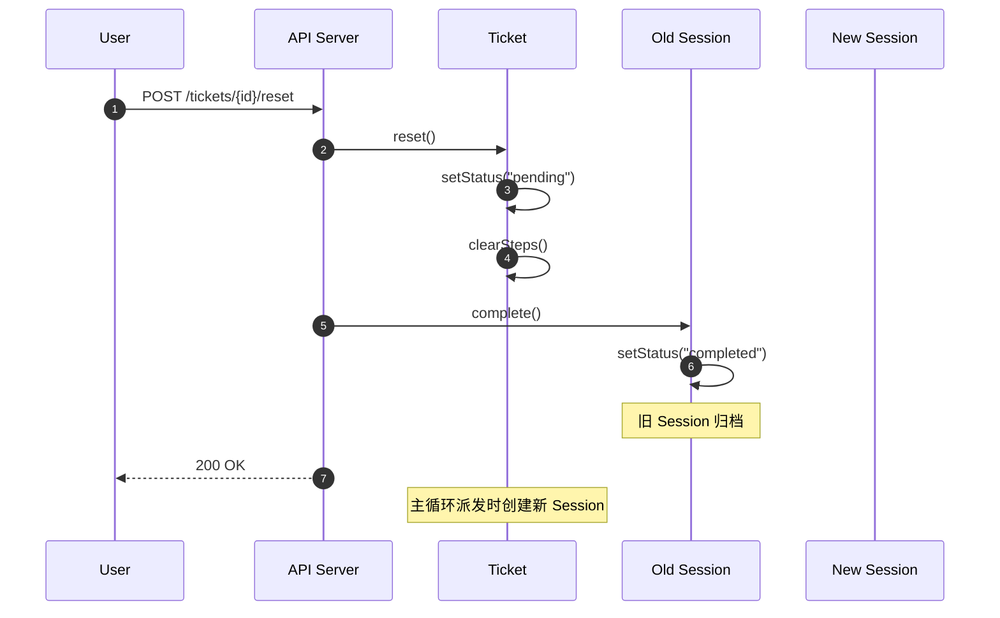
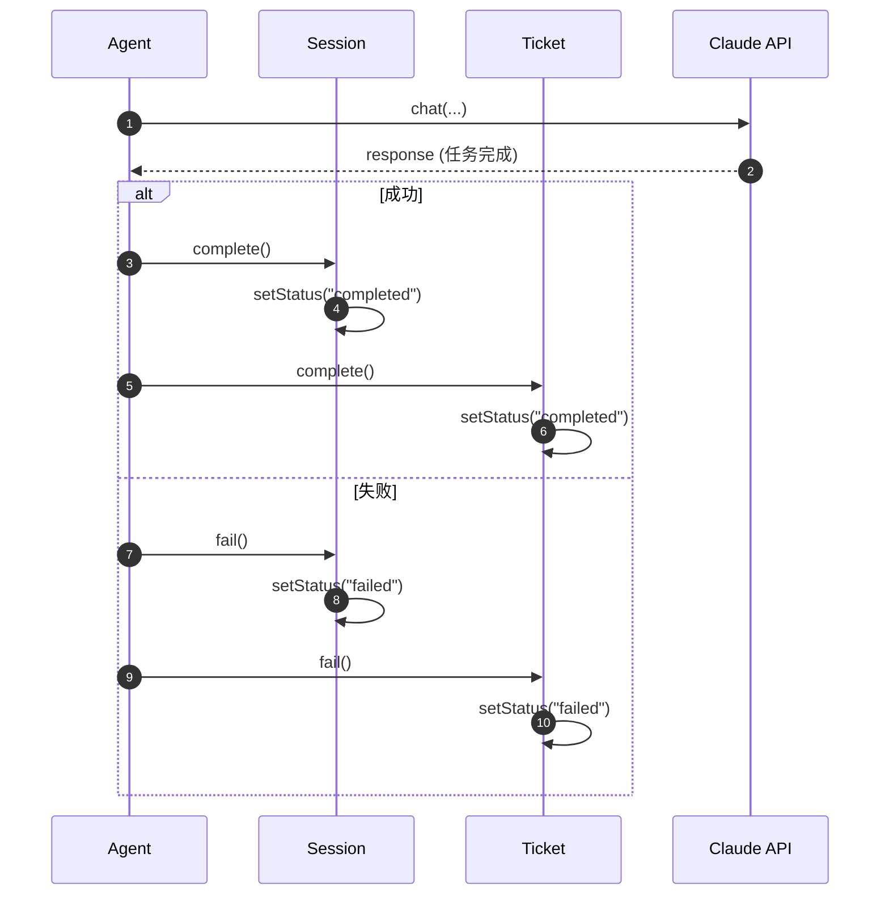

# Agent 平台逻辑审计报告

## 1. Scenario Extraction

| # | Scenario | Entities Involved | Key Actions |
|---|----------|-------------------|-------------|
| 1 | 用户创建并提交 Ticket | User, Ticket, Agent | create(), start() |
| 2 | 主循环派发 Ticket 给 Agent | MainLoop, Ticket, Agent, Session | dispatch(), createSession() |
| 3 | Agent 执行任务并更新步骤 | Agent, Session, Ticket, Tool | execute(), addStep(), addMessage() |
| 4 | Agent 请求人工介入 | Agent, Session, Ticket | suspend(), waitForInput() |
| 5 | 用户完成人工介入 | User, Session, Ticket | submitInput(), resume() |
| 6 | Ticket 重置为待处理 | Ticket, Session | reset(), createNewSession() |
| 7 | 任务完成/失败 | Agent, Session, Ticket | complete(), fail() |

> **Total scenarios identified**: 7

---

## 2. Sequence Diagrams

### Scenario 1: 用户创建并提交 Ticket



**Observations**:
- ✅ 流程清晰，Ticket 创建后进入 pending 状态等待主循环派发
- ⚠️ 缺失：创建时是否验证 agent_id 存在？

---

### Scenario 2: 主循环派发 Ticket 给 Agent



**Observations**:
- ✅ 轮询机制符合设计决策 (1-3 秒间隔)
- ⚠️ 缺失：如果 Agent 正在执行另一个任务怎么办？是否支持并发？
- ⚠️ 缺失：MainLoop 是否需要作为领域概念？目前未在 W1 中定义

---

### Scenario 3: Agent 执行任务并更新步骤



**Observations**:
- ✅ 核心执行流程完整
- ⚠️ 缺失：Step 什么时候创建？是先创建 (pending) 再更新 (completed)，还是完成后直接添加？
- ⚠️ 缺失：Tool.execute() 失败如何处理？
- ⚠️ 缺失：Session.context 和 Ticket.context 在执行过程中如何协调？

---

### Scenario 4: Agent 请求人工介入



**Observations**:
- ✅ Ticket 和 Session 状态同步挂起
- ⚠️ 缺失：Agent 如何判断"需要人工输入"？是 LLM 返回特定格式，还是 Agent 自行分析？
- ⚠️ 缺失：挂起时需要存储"等待什么输入"的提示信息，当前 Message 能否满足？

---

### Scenario 5: 用户完成人工介入



**Observations**:
- ⚠️ 重要问题：用户回复后 Ticket 变为 pending，但 Session 已经存在。主循环是否会创建新 Session？
- ⚠️ 这里与 W1 的设计决策冲突："一个 Ticket 在运行中对应一个 Session，但假如 Ticket 被前置为待处理，则需要重新创建 session 实例"
- 🔴 **关键缺口**：挂起恢复 vs 重置为待处理，是两种不同的场景，需要区分！

---

### Scenario 6: Ticket 重置为待处理（创建新 Session）



**Observations**:
- ✅ 符合"一个 Ticket 可以有多个 Session 历史"的设计
- ⚠️ 缺失：reset() 是否应该清空 steps？还是保留历史？
- ⚠️ 缺失：Ticket.context（静态）是否重置？按定义应该不可变

---

### Scenario 7: 任务完成/失败



**Observations**:
- ⚠️ 缺失：Session 没有 failed 状态（W1 只定义了 active | suspended | completed）
- ⚠️ 缺失：失败原因存储在哪里？Ticket 还是 Session？
- ⚠️ 缺失：Agent 如何判断"任务完成"？LLM 返回特定标记？

---

## 3. Gap Analysis Report

### Summary

| Severity | Count | Description |
|----------|-------|-------------|
| 🔴 Critical | 2 | 阻塞核心流程的设计缺陷 |
| 🟠 Major | 4 | 职责不清或调用链断裂 |
| 🟡 Minor | 3 | 优化建议 |
| 🔵 Info | 2 | 需要澄清的问题 |

---

### 🔴 Critical Issues

#### GAP-001: 挂起恢复 vs 重置为待处理 场景混淆

- **Scenario**: Scenario 5 & 6
- **Problem**: W1 设计决策说"Ticket 被前置为待处理则需要重新创建 session"，但挂起后恢复不应该创建新 Session，应该继续使用当前 Session。
- **Impact**: 如果挂起恢复也创建新 Session，对话历史会丢失。
- **Suggested Fix**: 
  - 区分两种操作：`resume()` 恢复挂起（不创建新 Session），`reset()` 重置（创建新 Session）
  - Ticket 状态增加 `suspended` 状态，与 `pending` 区分

#### GAP-002: Session 缺少 failed 状态

- **Scenario**: Scenario 7
- **Problem**: Session.status 只有 `active | suspended | completed`，没有 `failed`
- **Impact**: 无法区分 Session 是正常完成还是失败终止
- **Suggested Fix**: 添加 `failed` 状态到 Session.status enum

---

### 🟠 Major Issues

#### GAP-003: MainLoop 未作为领域概念定义

- **Scenario**: Scenario 2
- **Problem**: 主循环是核心调度组件，但未在 W1 中定义
- **Impact**: 职责边界不清，实现时容易产生混乱
- **Suggested Fix**: 添加 `Scheduler` 或 `Dispatcher` 作为应用服务（非领域实体），明确其职责

#### GAP-004: Agent 并发执行策略未定义

- **Scenario**: Scenario 2
- **Problem**: 如果一个 Agent 被分配给多个 Ticket，是并发执行还是排队？
- **Impact**: 影响系统吞吐量设计
- **Suggested Fix**: 明确策略：1) 一个 Agent 可同时处理多个 Ticket（并发），或 2) 一个 Agent 同时只处理一个

#### GAP-005: Tool 执行失败处理未定义

- **Scenario**: Scenario 3
- **Problem**: Tool.execute() 失败后如何处理？是重试、跳过还是终止任务？
- **Impact**: 影响系统健壮性
- **Suggested Fix**: 
  - Tool 返回结构化结果 `{success: boolean, result?: any, error?: string}`
  - Agent 根据 LLM 判断决定后续动作

#### GAP-006: 任务完成/人工介入的判断机制不明确

- **Scenario**: Scenario 4 & 7
- **Problem**: Agent 如何判断 LLM 返回需要"人工介入"或"任务完成"？
- **Impact**: 影响 Agent 的控制流实现
- **Suggested Fix**: 
  - 使用 `claude_agent_sdk` 的 tool 机制，定义 `request_human_input` 和 `complete_task` 作为 Agent 可调用的"系统工具"

---

### 🟡 Minor Issues

#### GAP-007: Step 创建时机不明确

- **Scenario**: Scenario 3
- **Problem**: Step 是先创建 (pending) 再更新 (running → completed)，还是完成后一次性添加？
- **Impact**: 影响前端进度展示
- **Suggested Fix**: 建议先创建 (pending)，执行中更新为 (running)，便于实时展示进度

#### GAP-008: 失败原因存储位置不明确

- **Scenario**: Scenario 7
- **Problem**: 任务失败时，失败原因存储在 Ticket 还是 Session？
- **Impact**: 影响错误追踪
- **Suggested Fix**: 
  - Ticket 添加 `error_message: string` 属性
  - 或者最后一条 Session.messages 记录错误详情

#### GAP-009: Ticket.steps 在 reset 时是否清空

- **Scenario**: Scenario 6
- **Problem**: reset() 时是清空 steps 还是保留历史？
- **Impact**: 影响任务追溯
- **Suggested Fix**: 保留 steps 作为历史记录，新 Session 的 steps 追加到后面

---

### 🔵 Info / Questions

- **Q1**: 技术选型中使用 `claude_agent_sdk`，是否需要在领域模型中显式体现 LLM 调用？
- **Q2**: Agent 的 `prompt` 是纯文本还是支持模板变量（如 `{{ticket.params}}`）？

---

## 4. Refinement Suggestions

> 以下建议应更新到 W1 领域模型中。

### For Ticket (工单)

| Change | Type | Rationale |
|--------|------|-----------|
| 状态增加 `suspended` | Modify Property | GAP-001: 区分挂起和待处理 |
| 添加 `error_message: string` | New Property | GAP-008: 存储失败原因 |
| 添加 `resume()` 行为 | New Behavior | GAP-001: 挂起恢复操作 |
| 添加 `reset()` 行为 | New Behavior | GAP-001: 重置操作（创建新 Session） |

**更新后的状态图**:
```
pending → running → suspended → running (恢复)
                  ↘ completed
                  ↘ failed
       ← reset() ←
```

### For Session (会话)

| Change | Type | Rationale |
|--------|------|-----------|
| 状态增加 `failed` | Modify Property | GAP-002: 区分正常完成和失败 |

### For Tool (工具)

| Change | Type | Rationale |
|--------|------|-----------|
| 返回值结构化 `{success, result, error}` | Modify Behavior | GAP-005: 支持失败处理 |

### New Concepts to Consider

| Concept | Type | Rationale |
|---------|------|-----------|
| Scheduler | Application Service | GAP-003: 主循环调度器，非领域实体 |
| SystemTool (request_human_input, complete_task) | Special Tool Type | GAP-006: Agent 控制流工具 |

---

## 5. Verification Checklist

| # | Scenario | Test Case | Expected Outcome |
|---|----------|-----------|------------------|
| 1 | 创建 Ticket | 创建 Ticket 指定有效 agent_id | Ticket 创建成功，status = "pending" |
| 2 | 创建 Ticket | 创建 Ticket 指定无效 agent_id | 返回 404 错误 |
| 3 | 派发 Ticket | 主循环扫描到 pending Ticket | 创建 Session，Ticket status → "running" |
| 4 | 执行任务 | Agent 调用 Tool 成功 | Session 添加 tool message，Ticket 添加 step |
| 5 | 执行任务 | Agent 调用 Tool 失败 | Tool 返回 error，Agent 继续或终止任务 |
| 6 | 人工介入 | Agent 判断需要人工输入 | Session/Ticket status → "suspended" |
| 7 | 恢复执行 | 用户提交输入，调用 resume | Session status → "active"，Ticket → "running"，继续原 Session |
| 8 | 重置 Ticket | 用户调用 reset | Ticket status → "pending"，旧 Session 完成，主循环创建新 Session |
| 9 | 任务完成 | Agent 判断任务完成 | Session/Ticket status → "completed" |
| 10 | 任务失败 | Agent 遇到不可恢复错误 | Session/Ticket status → "failed"，记录 error_message |
