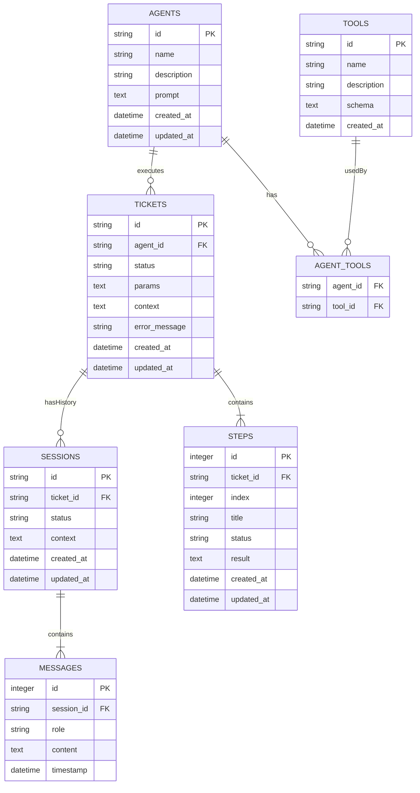

# Agent 平台 Schema Architect 分析

## 1. Technology Stack Decision

### Database
- **Type**: SQLite 3
- **Rationale**: 符合 PRD 技术选型要求，轻量级、零配置，适合初期开发和单机部署

### API Style
- **Type**: REST (OpenAPI 3.0)
- **Rationale**: 
  - 与 FastAPI 完美集成，自动生成 Swagger 文档
  - 标准化工具链支持
  - 前端 React 调用友好

### Serialization
- **Date Format**: ISO 8601 (`2024-01-15T10:30:00Z`)
- **ID Format**: UUID v4 (36 字符字符串)
- **JSON Fields**: TEXT 存储，应用层序列化/反序列化

---

## 2. Database Schema (DDL)

### ER Diagram



### Tables

```sql
-- ============================================================
-- Agent 代理表
-- ============================================================
CREATE TABLE agents (
    id VARCHAR(36) PRIMARY KEY,
    name VARCHAR(100) NOT NULL,
    description TEXT,
    prompt TEXT NOT NULL,
    created_at TIMESTAMP DEFAULT CURRENT_TIMESTAMP,
    updated_at TIMESTAMP DEFAULT CURRENT_TIMESTAMP
);

-- ============================================================
-- Tool 工具表
-- ============================================================
CREATE TABLE tools (
    id VARCHAR(36) PRIMARY KEY,
    name VARCHAR(100) NOT NULL UNIQUE,
    description TEXT,
    schema TEXT NOT NULL,  -- JSON Schema 定义输入参数
    created_at TIMESTAMP DEFAULT CURRENT_TIMESTAMP
);

-- ============================================================
-- Agent-Tool 关联表 (多对多)
-- ============================================================
CREATE TABLE agent_tools (
    agent_id VARCHAR(36) NOT NULL,
    tool_id VARCHAR(36) NOT NULL,
    PRIMARY KEY (agent_id, tool_id),
    FOREIGN KEY (agent_id) REFERENCES agents(id) ON DELETE CASCADE,
    FOREIGN KEY (tool_id) REFERENCES tools(id) ON DELETE CASCADE
);

-- ============================================================
-- Ticket 工单表 (聚合根)
-- ============================================================
CREATE TABLE tickets (
    id VARCHAR(36) PRIMARY KEY,
    agent_id VARCHAR(36) NOT NULL,
    status VARCHAR(20) NOT NULL DEFAULT 'pending' 
        CHECK (status IN ('pending', 'running', 'suspended', 'completed', 'failed')),
    params TEXT,          -- JSON: 用户输入参数
    context TEXT,         -- JSON: 静态任务定义（目标、约束条件）
    error_message TEXT,   -- 失败原因 (GAP-008)
    created_at TIMESTAMP DEFAULT CURRENT_TIMESTAMP,
    updated_at TIMESTAMP DEFAULT CURRENT_TIMESTAMP,
    FOREIGN KEY (agent_id) REFERENCES agents(id)
);

CREATE INDEX idx_tickets_status ON tickets(status);
CREATE INDEX idx_tickets_agent_id ON tickets(agent_id);

-- ============================================================
-- Session 会话表
-- ============================================================
CREATE TABLE sessions (
    id VARCHAR(36) PRIMARY KEY,
    ticket_id VARCHAR(36) NOT NULL,
    status VARCHAR(20) NOT NULL DEFAULT 'active'
        CHECK (status IN ('active', 'suspended', 'completed', 'failed')),  -- 添加 failed (GAP-002)
    context TEXT,         -- JSON: 动态运行时状态（中间结果、临时变量）
    created_at TIMESTAMP DEFAULT CURRENT_TIMESTAMP,
    updated_at TIMESTAMP DEFAULT CURRENT_TIMESTAMP,
    FOREIGN KEY (ticket_id) REFERENCES tickets(id) ON DELETE CASCADE
);

CREATE INDEX idx_sessions_ticket_id ON sessions(ticket_id);
CREATE INDEX idx_sessions_status ON sessions(status);

-- ============================================================
-- Step 步骤表 (嵌入 Ticket 的值对象)
-- ============================================================
CREATE TABLE steps (
    id INTEGER PRIMARY KEY AUTOINCREMENT,
    ticket_id VARCHAR(36) NOT NULL,
    idx INTEGER NOT NULL,
    title VARCHAR(200) NOT NULL,
    status VARCHAR(20) NOT NULL DEFAULT 'pending'
        CHECK (status IN ('pending', 'running', 'completed', 'failed')),
    result TEXT,          -- JSON: 步骤结果
    created_at TIMESTAMP DEFAULT CURRENT_TIMESTAMP,
    updated_at TIMESTAMP DEFAULT CURRENT_TIMESTAMP,
    FOREIGN KEY (ticket_id) REFERENCES tickets(id) ON DELETE CASCADE,
    UNIQUE (ticket_id, idx)
);

CREATE INDEX idx_steps_ticket_id ON steps(ticket_id);

-- ============================================================
-- Message 消息表 (嵌入 Session 的值对象)
-- ============================================================
CREATE TABLE messages (
    id INTEGER PRIMARY KEY AUTOINCREMENT,
    session_id VARCHAR(36) NOT NULL,
    role VARCHAR(20) NOT NULL CHECK (role IN ('user', 'assistant', 'system', 'tool')),
    content TEXT NOT NULL,
    timestamp TIMESTAMP DEFAULT CURRENT_TIMESTAMP,
    FOREIGN KEY (session_id) REFERENCES sessions(id) ON DELETE CASCADE
);

CREATE INDEX idx_messages_session_id ON messages(session_id);
```

---

## 3. API Specification (OpenAPI)

### Endpoints Overview

| Method | Path | Description | operationId |
|--------|------|-------------|-------------|
| **Agents** |
| GET | /api/agents | 获取所有 Agent 列表 | listAgents |
| GET | /api/agents/{id} | 获取 Agent 详情 | getAgent |
| POST | /api/agents | 创建 Agent | createAgent |
| PUT | /api/agents/{id} | 更新 Agent | updateAgent |
| DELETE | /api/agents/{id} | 删除 Agent | deleteAgent |
| **Tools** |
| GET | /api/tools | 获取所有 Tool 列表 | listTools |
| GET | /api/tools/{id} | 获取 Tool 详情 | getTool |
| **Tickets** |
| GET | /api/tickets | 获取 Ticket 列表 | listTickets |
| GET | /api/tickets/{id} | 获取 Ticket 详情 | getTicket |
| POST | /api/tickets | 创建 Ticket | createTicket |
| PATCH | /api/tickets/{id}/resume | 恢复挂起的 Ticket | resumeTicket |
| PATCH | /api/tickets/{id}/reset | 重置 Ticket | resetTicket |
| DELETE | /api/tickets/{id} | 删除 Ticket | deleteTicket |
| **Sessions** |
| GET | /api/sessions | 获取 Session 列表 | listSessions |
| GET | /api/sessions/{id} | 获取 Session 详情 | getSession |
| POST | /api/sessions/{id}/messages | 添加消息（人工介入） | addMessage |

### OpenAPI Specification

```yaml
openapi: 3.0.3
info:
  title: Agent Platform API
  version: 0.0.1
  description: Agent 平台后端 API

servers:
  - url: http://localhost:8000
    description: Development server

paths:
  # ===================== Agents =====================
  /api/agents:
    get:
      operationId: listAgents
      summary: 获取所有 Agent 列表
      tags: [Agents]
      responses:
        '200':
          description: Agent 列表
          content:
            application/json:
              schema:
                type: array
                items:
                  $ref: '#/components/schemas/AgentSummary'

    post:
      operationId: createAgent
      summary: 创建 Agent
      tags: [Agents]
      requestBody:
        required: true
        content:
          application/json:
            schema:
              $ref: '#/components/schemas/CreateAgentRequest'
      responses:
        '201':
          description: 创建成功
          content:
            application/json:
              schema:
                $ref: '#/components/schemas/AgentResponse'
        '400':
          $ref: '#/components/responses/BadRequest'

  /api/agents/{id}:
    parameters:
      - $ref: '#/components/parameters/AgentId'

    get:
      operationId: getAgent
      summary: 获取 Agent 详情
      tags: [Agents]
      responses:
        '200':
          description: Agent 详情
          content:
            application/json:
              schema:
                $ref: '#/components/schemas/AgentResponse'
        '404':
          $ref: '#/components/responses/NotFound'

    put:
      operationId: updateAgent
      summary: 更新 Agent
      tags: [Agents]
      requestBody:
        required: true
        content:
          application/json:
            schema:
              $ref: '#/components/schemas/UpdateAgentRequest'
      responses:
        '200':
          description: 更新成功
          content:
            application/json:
              schema:
                $ref: '#/components/schemas/AgentResponse'
        '404':
          $ref: '#/components/responses/NotFound'

    delete:
      operationId: deleteAgent
      summary: 删除 Agent
      tags: [Agents]
      responses:
        '204':
          description: 删除成功
        '404':
          $ref: '#/components/responses/NotFound'

  # ===================== Tools =====================
  /api/tools:
    get:
      operationId: listTools
      summary: 获取所有 Tool 列表
      tags: [Tools]
      responses:
        '200':
          description: Tool 列表
          content:
            application/json:
              schema:
                type: array
                items:
                  $ref: '#/components/schemas/ToolResponse'

  /api/tools/{id}:
    parameters:
      - $ref: '#/components/parameters/ToolId'

    get:
      operationId: getTool
      summary: 获取 Tool 详情
      tags: [Tools]
      responses:
        '200':
          description: Tool 详情
          content:
            application/json:
              schema:
                $ref: '#/components/schemas/ToolResponse'
        '404':
          $ref: '#/components/responses/NotFound'

  # ===================== Tickets =====================
  /api/tickets:
    get:
      operationId: listTickets
      summary: 获取 Ticket 列表
      tags: [Tickets]
      parameters:
        - name: status
          in: query
          schema:
            $ref: '#/components/schemas/TicketStatus'
        - name: agentId
          in: query
          schema:
            type: string
            format: uuid
      responses:
        '200':
          description: Ticket 列表
          content:
            application/json:
              schema:
                type: array
                items:
                  $ref: '#/components/schemas/TicketSummary'

    post:
      operationId: createTicket
      summary: 创建 Ticket
      tags: [Tickets]
      requestBody:
        required: true
        content:
          application/json:
            schema:
              $ref: '#/components/schemas/CreateTicketRequest'
      responses:
        '201':
          description: 创建成功
          content:
            application/json:
              schema:
                $ref: '#/components/schemas/TicketResponse'
        '400':
          $ref: '#/components/responses/BadRequest'
        '404':
          description: Agent 不存在

  /api/tickets/{id}:
    parameters:
      - $ref: '#/components/parameters/TicketId'

    get:
      operationId: getTicket
      summary: 获取 Ticket 详情
      tags: [Tickets]
      responses:
        '200':
          description: Ticket 详情（含 steps）
          content:
            application/json:
              schema:
                $ref: '#/components/schemas/TicketResponse'
        '404':
          $ref: '#/components/responses/NotFound'

    delete:
      operationId: deleteTicket
      summary: 删除 Ticket
      tags: [Tickets]
      responses:
        '204':
          description: 删除成功
        '404':
          $ref: '#/components/responses/NotFound'

  /api/tickets/{id}/resume:
    parameters:
      - $ref: '#/components/parameters/TicketId'

    patch:
      operationId: resumeTicket
      summary: 恢复挂起的 Ticket（继续原 Session）
      description: |
        针对 suspended 状态的 Ticket，恢复执行。
        - 将 Ticket 状态设为 running
        - Session 状态设为 active
        - 主循环将继续处理该 Ticket
      tags: [Tickets]
      responses:
        '200':
          description: 恢复成功
          content:
            application/json:
              schema:
                $ref: '#/components/schemas/TicketResponse'
        '400':
          description: Ticket 非 suspended 状态
        '404':
          $ref: '#/components/responses/NotFound'

  /api/tickets/{id}/reset:
    parameters:
      - $ref: '#/components/parameters/TicketId'

    patch:
      operationId: resetTicket
      summary: 重置 Ticket（创建新 Session）
      description: |
        重置 Ticket 为 pending 状态，归档当前 Session。
        - 将当前 Session 标记为 completed
        - 将 Ticket 状态设为 pending
        - 主循环将创建新 Session
        - 注意：不清空 steps，保留历史记录
      tags: [Tickets]
      responses:
        '200':
          description: 重置成功
          content:
            application/json:
              schema:
                $ref: '#/components/schemas/TicketResponse'
        '404':
          $ref: '#/components/responses/NotFound'

  # ===================== Sessions =====================
  /api/sessions:
    get:
      operationId: listSessions
      summary: 获取 Session 列表
      tags: [Sessions]
      parameters:
        - name: ticketId
          in: query
          schema:
            type: string
            format: uuid
      responses:
        '200':
          description: Session 列表
          content:
            application/json:
              schema:
                type: array
                items:
                  $ref: '#/components/schemas/SessionSummary'

  /api/sessions/{id}:
    parameters:
      - $ref: '#/components/parameters/SessionId'

    get:
      operationId: getSession
      summary: 获取 Session 详情
      tags: [Sessions]
      responses:
        '200':
          description: Session 详情（含 messages）
          content:
            application/json:
              schema:
                $ref: '#/components/schemas/SessionResponse'
        '404':
          $ref: '#/components/responses/NotFound'

  /api/sessions/{id}/messages:
    parameters:
      - $ref: '#/components/parameters/SessionId'

    post:
      operationId: addMessage
      summary: 添加消息（人工介入回复）
      description: |
        用户完成人工介入时调用。
        - 添加 user role 消息到 Session
        - 如果 Session 处于 suspended 状态，自动调用 resume
      tags: [Sessions]
      requestBody:
        required: true
        content:
          application/json:
            schema:
              $ref: '#/components/schemas/AddMessageRequest'
      responses:
        '201':
          description: 消息添加成功
          content:
            application/json:
              schema:
                $ref: '#/components/schemas/MessageResponse'
        '400':
          $ref: '#/components/responses/BadRequest'
        '404':
          $ref: '#/components/responses/NotFound'

components:
  parameters:
    AgentId:
      name: id
      in: path
      required: true
      schema:
        type: string
        format: uuid

    ToolId:
      name: id
      in: path
      required: true
      schema:
        type: string
        format: uuid

    TicketId:
      name: id
      in: path
      required: true
      schema:
        type: string
        format: uuid

    SessionId:
      name: id
      in: path
      required: true
      schema:
        type: string
        format: uuid

  responses:
    BadRequest:
      description: 请求参数错误
      content:
        application/json:
          schema:
            $ref: '#/components/schemas/ErrorResponse'

    NotFound:
      description: 资源不存在
      content:
        application/json:
          schema:
            $ref: '#/components/schemas/ErrorResponse'

  schemas:
    # ===================== Enums =====================
    TicketStatus:
      type: string
      enum: [pending, running, suspended, completed, failed]

    SessionStatus:
      type: string
      enum: [active, suspended, completed, failed]

    StepStatus:
      type: string
      enum: [pending, running, completed, failed]

    MessageRole:
      type: string
      enum: [user, assistant, system, tool]

    # ===================== Agent =====================
    AgentSummary:
      type: object
      properties:
        id:
          type: string
          format: uuid
        name:
          type: string
        description:
          type: string
      required: [id, name]

    AgentResponse:
      type: object
      properties:
        id:
          type: string
          format: uuid
        name:
          type: string
        description:
          type: string
        prompt:
          type: string
        toolIds:
          type: array
          items:
            type: string
            format: uuid
        createdAt:
          type: string
          format: date-time
        updatedAt:
          type: string
          format: date-time
      required: [id, name, prompt, toolIds, createdAt, updatedAt]

    CreateAgentRequest:
      type: object
      properties:
        name:
          type: string
          minLength: 1
          maxLength: 100
        description:
          type: string
        prompt:
          type: string
          minLength: 1
        toolIds:
          type: array
          items:
            type: string
            format: uuid
      required: [name, prompt]

    UpdateAgentRequest:
      type: object
      properties:
        name:
          type: string
          minLength: 1
          maxLength: 100
        description:
          type: string
        prompt:
          type: string
          minLength: 1
        toolIds:
          type: array
          items:
            type: string
            format: uuid

    # ===================== Tool =====================
    ToolResponse:
      type: object
      properties:
        id:
          type: string
          format: uuid
        name:
          type: string
        description:
          type: string
        schema:
          type: object
          description: JSON Schema 定义工具输入参数
        createdAt:
          type: string
          format: date-time
      required: [id, name, schema, createdAt]

    # ===================== Ticket =====================
    TicketSummary:
      type: object
      properties:
        id:
          type: string
          format: uuid
        agentId:
          type: string
          format: uuid
        agentName:
          type: string
        status:
          $ref: '#/components/schemas/TicketStatus'
        createdAt:
          type: string
          format: date-time
        updatedAt:
          type: string
          format: date-time
      required: [id, agentId, agentName, status, createdAt, updatedAt]

    TicketResponse:
      type: object
      properties:
        id:
          type: string
          format: uuid
        agentId:
          type: string
          format: uuid
        agentName:
          type: string
        status:
          $ref: '#/components/schemas/TicketStatus'
        params:
          type: object
          description: 用户输入参数（自由格式 JSON）
        context:
          type: object
          description: 静态任务定义（目标、约束条件）
        errorMessage:
          type: string
          nullable: true
          description: 失败原因
        steps:
          type: array
          items:
            $ref: '#/components/schemas/StepResponse'
        currentSessionId:
          type: string
          format: uuid
          nullable: true
          description: 当前活动 Session ID
        createdAt:
          type: string
          format: date-time
        updatedAt:
          type: string
          format: date-time
      required: [id, agentId, status, steps, createdAt, updatedAt]

    CreateTicketRequest:
      type: object
      properties:
        agentId:
          type: string
          format: uuid
        params:
          type: object
          description: 用户输入参数
        context:
          type: object
          description: 静态任务定义
      required: [agentId]

    # ===================== Step =====================
    StepResponse:
      type: object
      properties:
        index:
          type: integer
        title:
          type: string
        status:
          $ref: '#/components/schemas/StepStatus'
        result:
          type: object
          nullable: true
        createdAt:
          type: string
          format: date-time
        updatedAt:
          type: string
          format: date-time
      required: [index, title, status, createdAt, updatedAt]

    # ===================== Session =====================
    SessionSummary:
      type: object
      properties:
        id:
          type: string
          format: uuid
        ticketId:
          type: string
          format: uuid
        status:
          $ref: '#/components/schemas/SessionStatus'
        messageCount:
          type: integer
        createdAt:
          type: string
          format: date-time
        updatedAt:
          type: string
          format: date-time
      required: [id, ticketId, status, messageCount, createdAt, updatedAt]

    SessionResponse:
      type: object
      properties:
        id:
          type: string
          format: uuid
        ticketId:
          type: string
          format: uuid
        status:
          $ref: '#/components/schemas/SessionStatus'
        context:
          type: object
          description: 动态运行时状态
        messages:
          type: array
          items:
            $ref: '#/components/schemas/MessageResponse'
        createdAt:
          type: string
          format: date-time
        updatedAt:
          type: string
          format: date-time
      required: [id, ticketId, status, messages, createdAt, updatedAt]

    # ===================== Message =====================
    MessageResponse:
      type: object
      properties:
        id:
          type: integer
        role:
          $ref: '#/components/schemas/MessageRole'
        content:
          type: string
        timestamp:
          type: string
          format: date-time
      required: [id, role, content, timestamp]

    AddMessageRequest:
      type: object
      properties:
        content:
          type: string
          minLength: 1
      required: [content]

    # ===================== Error =====================
    ErrorResponse:
      type: object
      properties:
        error:
          type: string
        message:
          type: string
      required: [error, message]
```

---

## 4. DTO Definitions (JSON Schema)

### TicketResponse (完整示例)

```json
{
  "$schema": "http://json-schema.org/draft-07/schema#",
  "title": "TicketResponse",
  "type": "object",
  "properties": {
    "id": { "type": "string", "format": "uuid" },
    "agentId": { "type": "string", "format": "uuid" },
    "agentName": { "type": "string" },
    "status": { 
      "type": "string", 
      "enum": ["pending", "running", "suspended", "completed", "failed"] 
    },
    "params": { "type": "object" },
    "context": { "type": "object" },
    "errorMessage": { "type": ["string", "null"] },
    "steps": {
      "type": "array",
      "items": {
        "type": "object",
        "properties": {
          "index": { "type": "integer", "minimum": 0 },
          "title": { "type": "string" },
          "status": { 
            "type": "string", 
            "enum": ["pending", "running", "completed", "failed"] 
          },
          "result": { "type": ["object", "null"] },
          "createdAt": { "type": "string", "format": "date-time" },
          "updatedAt": { "type": "string", "format": "date-time" }
        },
        "required": ["index", "title", "status", "createdAt", "updatedAt"]
      }
    },
    "currentSessionId": { "type": ["string", "null"], "format": "uuid" },
    "createdAt": { "type": "string", "format": "date-time" },
    "updatedAt": { "type": "string", "format": "date-time" }
  },
  "required": ["id", "agentId", "status", "steps", "createdAt", "updatedAt"]
}
```

### SessionResponse (完整示例)

```json
{
  "$schema": "http://json-schema.org/draft-07/schema#",
  "title": "SessionResponse",
  "type": "object",
  "properties": {
    "id": { "type": "string", "format": "uuid" },
    "ticketId": { "type": "string", "format": "uuid" },
    "status": { 
      "type": "string", 
      "enum": ["active", "suspended", "completed", "failed"] 
    },
    "context": { "type": "object" },
    "messages": {
      "type": "array",
      "items": {
        "type": "object",
        "properties": {
          "id": { "type": "integer" },
          "role": { "type": "string", "enum": ["user", "assistant", "system", "tool"] },
          "content": { "type": "string" },
          "timestamp": { "type": "string", "format": "date-time" }
        },
        "required": ["id", "role", "content", "timestamp"]
      }
    },
    "createdAt": { "type": "string", "format": "date-time" },
    "updatedAt": { "type": "string", "format": "date-time" }
  },
  "required": ["id", "ticketId", "status", "messages", "createdAt", "updatedAt"]
}
```

### Sample Mock Data

#### Ticket 示例
```json
{
  "id": "550e8400-e29b-41d4-a716-446655440000",
  "agentId": "a1b2c3d4-e5f6-7890-abcd-ef1234567890",
  "agentName": "Code Review Agent",
  "status": "running",
  "params": {
    "repository": "https://github.com/example/repo",
    "branch": "main"
  },
  "context": {
    "goal": "Review pull request #123",
    "constraints": ["Focus on security issues", "Ignore style warnings"]
  },
  "errorMessage": null,
  "steps": [
    {
      "index": 0,
      "title": "Fetch repository",
      "status": "completed",
      "result": { "files_count": 42 },
      "createdAt": "2024-01-15T10:30:00Z",
      "updatedAt": "2024-01-15T10:30:30Z"
    },
    {
      "index": 1,
      "title": "Analyze code",
      "status": "running",
      "result": null,
      "createdAt": "2024-01-15T10:30:31Z",
      "updatedAt": "2024-01-15T10:30:31Z"
    }
  ],
  "currentSessionId": "session-uuid-here",
  "createdAt": "2024-01-15T10:29:00Z",
  "updatedAt": "2024-01-15T10:30:31Z"
}
```

#### Session 示例
```json
{
  "id": "session-uuid-here",
  "ticketId": "550e8400-e29b-41d4-a716-446655440000",
  "status": "active",
  "context": {
    "currentStep": 1,
    "analyzedFiles": ["src/main.py", "src/utils.py"]
  },
  "messages": [
    {
      "id": 1,
      "role": "system",
      "content": "You are a code review agent...",
      "timestamp": "2024-01-15T10:29:30Z"
    },
    {
      "id": 2,
      "role": "assistant",
      "content": "I will start by fetching the repository...",
      "timestamp": "2024-01-15T10:29:35Z"
    },
    {
      "id": 3,
      "role": "tool",
      "content": "{\"success\": true, \"files_count\": 42}",
      "timestamp": "2024-01-15T10:30:30Z"
    }
  ],
  "createdAt": "2024-01-15T10:29:30Z",
  "updatedAt": "2024-01-15T10:30:30Z"
}
```

---

## 5. Mapping Notes

### Domain → Database

| Domain Concept | DB Table(s) | Notes |
|----------------|-------------|-------|
| Agent | agents, agent_tools | 多对多关系通过关联表实现 |
| Tool | tools | 只读表，初期 hardcode |
| Ticket | tickets | 聚合根 |
| Step | steps | 值对象，有独立表便于查询 |
| Session | sessions | 一个 Ticket 有多个 Session 历史 |
| Message | messages | 值对象，有独立表便于查询 |

### Domain → API

| Domain Behavior | API Endpoint | Notes |
|-----------------|--------------|-------|
| Ticket.create() | POST /api/tickets | 创建后状态为 pending |
| Ticket.start() | (内部调用) | Scheduler 自动调用 |
| Ticket.suspend() | (内部调用) | Agent 请求人工介入时调用 |
| Ticket.resume() | PATCH /api/tickets/{id}/resume | 用户完成人工介入后调用 |
| Ticket.reset() | PATCH /api/tickets/{id}/reset | 用户主动重置 |
| Ticket.complete() | (内部调用) | Agent 完成任务时调用 |
| Ticket.fail() | (内部调用) | Agent 失败时调用 |
| Session.addMessage() | POST /api/sessions/{id}/messages | 人工介入时用户回复 |

### Naming Conventions

| Layer | Convention | Example |
|-------|------------|---------|
| Domain | PascalCase | `Ticket`, `Session`, `addStep()` |
| Database | snake_case | `tickets`, `agent_id`, `created_at` |
| API (JSON) | camelCase | `agentId`, `createdAt`, `errorMessage` |
| API (Path) | kebab-case | `/api/tickets/{id}/resume` |

---

## 6. Migration Considerations

### Execution Order

基于外键依赖，DDL 执行顺序：

1. `agents` (无依赖)
2. `tools` (无依赖)
3. `agent_tools` (依赖 agents, tools)
4. `tickets` (依赖 agents)
5. `sessions` (依赖 tickets)
6. `steps` (依赖 tickets)
7. `messages` (依赖 sessions)

### Initial Data (Seeds)

```sql
-- 初期 hardcode 的 Tools
INSERT INTO tools (id, name, description, schema) VALUES
('tool-read-file', 'read_file', '读取文件内容', '{"type":"object","properties":{"path":{"type":"string"}}}'),
('tool-write-file', 'write_file', '写入文件内容', '{"type":"object","properties":{"path":{"type":"string"},"content":{"type":"string"}}}'),
('tool-exec-cmd', 'execute_command', '执行 shell 命令', '{"type":"object","properties":{"command":{"type":"string"}}}'),
('tool-search-code', 'search_code', '搜索代码', '{"type":"object","properties":{"pattern":{"type":"string"},"path":{"type":"string"}}}'),
('tool-http-req', 'http_request', '发送 HTTP 请求', '{"type":"object","properties":{"url":{"type":"string"},"method":{"type":"string"}}}'),
('tool-fetch-web', 'fetch_webpage', '抓取网页内容', '{"type":"object","properties":{"url":{"type":"string"}}}');
```

### Future Evolution

| Change | Strategy | Breaking? |
|--------|----------|-----------|
| 新增 Ticket 状态 | 修改 CHECK 约束 | No |
| 新增 Tool | INSERT into tools | No |
| 添加 Ticket 优先级 | 添加 nullable `priority` 列 | No |
| 多租户支持 | 添加 `tenant_id` 列到所有表 | Yes (需迁移) |
| 软删除支持 | 添加 `deleted_at` 列 | No |

### GAP Fixes Applied

| GAP ID | Issue | Resolution |
|--------|-------|------------|
| GAP-001 | 挂起恢复 vs 重置混淆 | 分离 `/resume` 和 `/reset` API |
| GAP-002 | Session 缺少 failed 状态 | 添加到 CHECK 约束 |
| GAP-008 | 失败原因存储位置 | 添加 `error_message` 列到 tickets |
