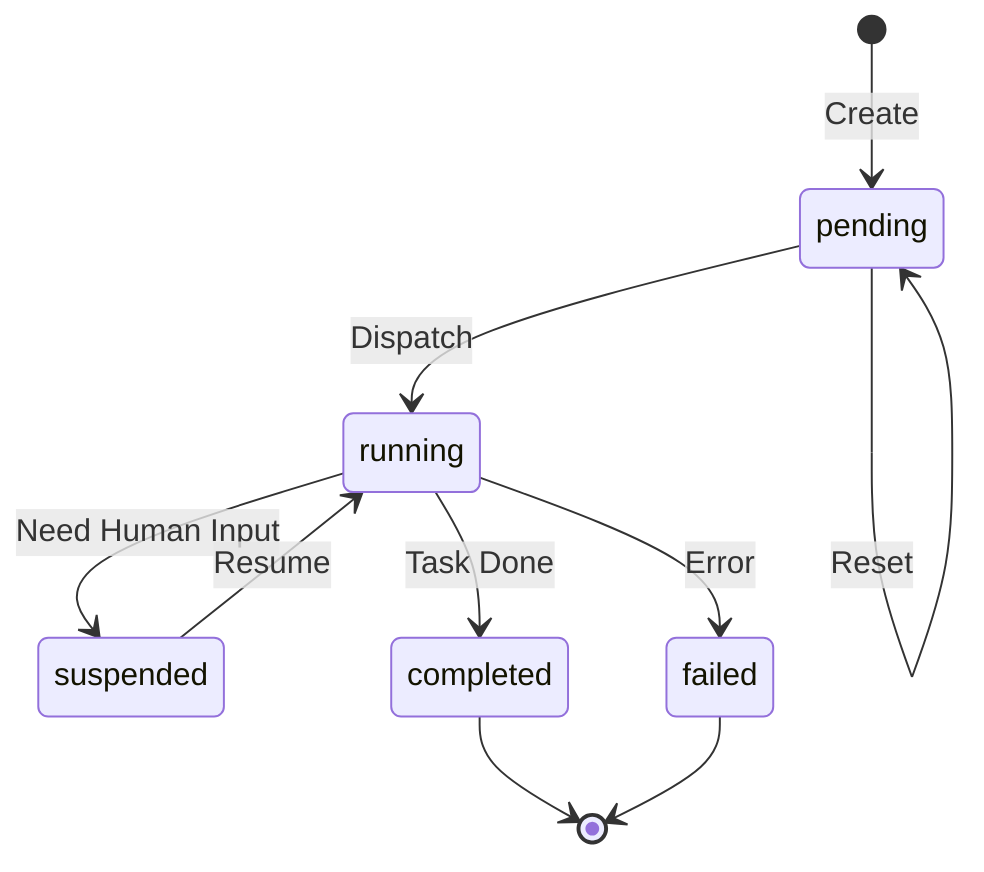
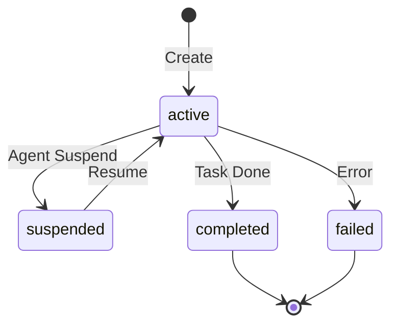

# Agent 平台 UI Simulator 原型

## 1. UI Component Breakdown

### Data → Component Mapping

| DTO Field | UI Component | Notes |
|-----------|--------------|-------|
| **Ticket** |
| ticket.id | ID Badge | 显示前 8 位 UUID |
| ticket.status | StatusBadge | pending=黄, running=蓝, suspended=橙, completed=绿, failed=红 |
| ticket.agentName | Tag | Agent 名称标签 |
| ticket.steps[] | StepList | 折叠式步骤列表 |
| ticket.errorMessage | ErrorAlert | 红色错误提示 |
| **Session** |
| session.status | StatusBadge | active=蓝, suspended=橙, completed=绿, failed=红 |
| session.messages[] | ChatHistory | 聊天气泡样式 |
| session.context | JSONViewer | 可折叠 JSON 展示 |
| **Agent** |
| agent.name | Card Header | 卡片标题 |
| agent.description | Text | 描述文本 |
| agent.prompt | CodeBlock | 代码块展示 |
| agent.toolIds[] | TagList | Tool 标签列表 |
| **Tool** |
| tool.name | Card Header | 卡片标题 |
| tool.schema | JSONViewer | JSON Schema 展示 |

### Page Structure

```
┌─────────────────────────────────────────────────────────────┐
│ Header: Agent Platform                                       │
├──────────────┬──────────────────────────────────────────────┤
│ Sidebar      │ Workspace                                     │
│              │                                               │
│ [Tickets]    │  ┌─────────────────────────────────────────┐ │
│ [Agents]     │  │ Entity List / Detail View               │ │
│ [Sessions]   │  │                                         │ │
│ [Tools]      │  │                                         │ │
│              │  │                                         │ │
│              │  └─────────────────────────────────────────┘ │
│              │                                               │
├──────────────┴──────────────────────────────────────────────┤
│ Footer                                                       │
└─────────────────────────────────────────────────────────────┘
```

---

## 2. Prototype HTML

见 [w4_prototype.html](file:///home/Deven/workspace/lab/agent_007/prd/0.0.1/w4_prototype.html)

---

## 3. State Transitions

### Ticket Status Flow



### Session Status Flow



### UI State Table

| View | Entity Status | Available Actions | UI State |
|------|---------------|-------------------|----------|
| Ticket List | pending | View, Reset | 黄色状态标 |
| Ticket List | running | View | 蓝色状态标 + 动画 |
| Ticket List | suspended | View, Resume | 橙色状态标 |
| Ticket Detail | suspended | 查看 Session, 人工介入 | 显示聊天输入框 |
| Session Detail | active | 查看消息历史 | 实时更新 |
| Session Detail | suspended | 发送消息 | 显示输入框 |

---

## 4. Verification Checklist

### 布局验证
- [ ] 左侧边栏固定宽度 (200px)
- [ ] 侧边栏导航项高亮当前页面
- [ ] 右侧工作区自适应宽度
- [ ] 响应式：移动端侧边栏可折叠

### Ticket 界面
- [ ] 列表正确显示所有 Ticket
- [ ] 状态标签颜色正确
- [ ] 点击进入详情页
- [ ] 详情页显示 Steps 列表
- [ ] Resume 按钮仅对 suspended 状态显示
- [ ] Reset 按钮功能正常

### Session 界面
- [ ] 消息按时间顺序显示
- [ ] 不同 role 消息样式区分 (user/assistant/tool/system)
- [ ] suspended 状态显示输入框
- [ ] 发送消息后列表更新

### Agent 界面
- [ ] 显示 Agent 基本信息
- [ ] Prompt 内容完整展示
- [ ] Tools 列表正确关联

### Tool 界面
- [ ] 显示 Tool 列表
- [ ] Schema 以 JSON 格式展示
