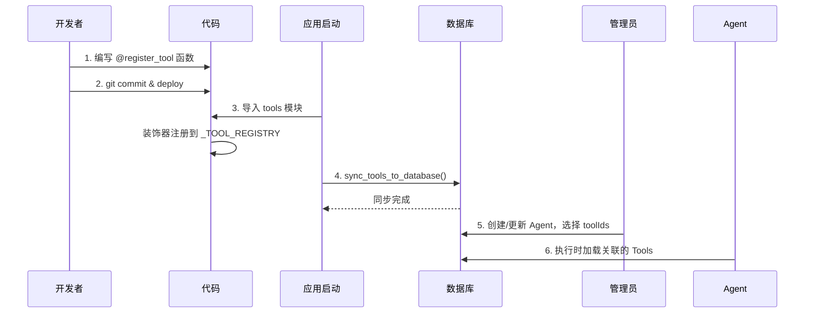

# Tools 自动注册机制技术设计

> 本文档细化 0.0.2 版本中 Tools 的自动注册机制设计。

---

## 1. 设计目标

### 1.1 现状问题

当前添加一个 Tool 需要：
1. 编写 tool 函数（如 `file_tools.py`）
2. 手动在 `__init__.py` 的 `TOOL_EXECUTORS` 字典中注册
3. 手动在数据库 `tools` 表中插入记录
4. 手动关联 Agent 到 Tool

这个过程繁琐且容易遗漏。

### 1.2 目标

```
编写带 @register_tool 装饰器的函数 → 自动注册到 tools 表
```

开发者只需：
1. 编写带装饰器的函数
2. 应用启动时自动同步到数据库

---

## 2. 核心设计

### 2.1 整合 claude_agent_sdk @tool 的装饰器

**设计目标**: 一个装饰器同时完成：
1. 注册到 `claude_agent_sdk`（运行时 SDK 调用）
2. 注册到 `_TOOL_REGISTRY`（数据库同步）

```python
# backend/app/tools/registry.py

from typing import Callable, Any, Awaitable
from functools import wraps
from claude_agent_sdk import tool as sdk_tool

# 全局注册表（用于数据库同步）
_TOOL_REGISTRY: dict[str, "ToolDefinition"] = {}


class ToolDefinition:
    """工具定义"""
    def __init__(
        self,
        name: str,
        description: str,
        input_schema: dict,
        sdk_tool_func: Callable,  # SDK 包装后的函数
    ):
        self.name = name
        self.description = description
        self.input_schema = input_schema
        self.sdk_tool_func = sdk_tool_func  # 直接给 SDK 使用


def register_tool(
    name: str,
    description: str,
    input_schema: dict[str, type] | dict,
):
    """
    统一工具注册装饰器
    
    同时完成:
    1. 注册到 claude_agent_sdk（运行时调用）
    2. 注册到 _TOOL_REGISTRY（数据库同步）
    
    使用示例:
    
    @register_tool(
        name="read_file",
        description="读取文件内容",
        input_schema={"path": str}
    )
    async def read_file(args: dict[str, Any]) -> dict[str, Any]:
        content = Path(args["path"]).read_text()
        return {
            "content": [{
                "type": "text",
                "text": content
            }]
        }
    """
    def decorator(func: Callable[[dict[str, Any]], Awaitable[dict[str, Any]]]):
        # 1. 使用 SDK 的 @tool 装饰器包装
        sdk_wrapped = sdk_tool(name, description, input_schema)(func)
        
        # 2. 转换 input_schema 为 JSON Schema 格式（用于数据库存储）
        json_schema = _convert_to_json_schema(input_schema)
        
        # 3. 注册到全局注册表
        _TOOL_REGISTRY[name] = ToolDefinition(
            name=name,
            description=description,
            input_schema=json_schema,
            sdk_tool_func=sdk_wrapped,
        )
        
        # 返回 SDK 包装后的函数
        return sdk_wrapped
    
    return decorator


def _convert_to_json_schema(input_schema: dict[str, type] | dict) -> dict:
    """
    将 SDK 格式的 schema 转换为 JSON Schema 格式
    
    SDK 格式: {"name": str, "age": int}
    JSON Schema: {
        "type": "object",
        "properties": {
            "name": {"type": "string"},
            "age": {"type": "integer"}
        },
        "required": ["name", "age"]
    }
    """
    # 如果已经是 JSON Schema 格式，直接返回
    if "type" in input_schema and input_schema.get("type") == "object":
        return input_schema
    
    # 类型映射
    type_map = {
        str: "string",
        int: "integer",
        float: "number",
        bool: "boolean",
        list: "array",
        dict: "object",
    }
    
    properties = {}
    required = []
    
    for field_name, field_type in input_schema.items():
        json_type = type_map.get(field_type, "string")
        properties[field_name] = {"type": json_type}
        required.append(field_name)
    
    return {
        "type": "object",
        "properties": properties,
        "required": required,
    }


def get_all_registered_tools() -> dict[str, ToolDefinition]:
    """获取所有注册的工具"""
    return _TOOL_REGISTRY.copy()


def get_sdk_tools_for_agent(tool_names: list[str]) -> list[Callable]:
    """获取 Agent 可用的 SDK 工具函数列表"""
    tools = []
    for name in tool_names:
        if name in _TOOL_REGISTRY:
            tools.append(_TOOL_REGISTRY[name].sdk_tool_func)
    return tools
```

### 2.2 重构现有 Tools（使用新装饰器）

```python
# backend/app/tools/file_tools.py

from typing import Any
from pathlib import Path
from app.tools.registry import register_tool


@register_tool(
    name="read_file",
    description="读取文件内容",
    input_schema={"path": str}
)
async def read_file(args: dict[str, Any]) -> dict[str, Any]:
    """读取文件内容"""
    path = args.get("path", "")
    
    try:
        content = Path(path).read_text(encoding="utf-8")
        return {
            "content": [{
                "type": "text",
                "text": content
            }]
        }
    except Exception as e:
        return {
            "content": [{
                "type": "text",
                "text": f"Error: {str(e)}"
            }],
            "is_error": True
        }


@register_tool(
    name="write_file",
    description="写入文件内容",
    input_schema={"path": str, "content": str}
)
async def write_file(args: dict[str, Any]) -> dict[str, Any]:
    """写入文件内容"""
    path = args.get("path", "")
    content = args.get("content", "")
    
    try:
        file_path = Path(path)
        file_path.parent.mkdir(parents=True, exist_ok=True)
        file_path.write_text(content, encoding="utf-8")
        return {
            "content": [{
                "type": "text",
                "text": f"Successfully wrote {len(content)} bytes to {path}"
            }]
        }
    except Exception as e:
        return {
            "content": [{
                "type": "text",
                "text": f"Error: {str(e)}"
            }],
            "is_error": True
        }
```

### 2.3 数据库同步

```python
# backend/app/tools/sync.py

import uuid
from sqlalchemy.ext.asyncio import AsyncSession
from sqlalchemy import select

from app.models.tool import Tool
from app.tools.registry import get_all_registered_tools


async def sync_tools_to_database(db: AsyncSession) -> dict:
    """
    同步注册的 Tools 到数据库
    
    返回: {
        "created": ["tool1", "tool2"],
        "updated": ["tool3"],
        "unchanged": ["tool4"]
    }
    """
    result = {"created": [], "updated": [], "unchanged": []}
    
    registered_tools = get_all_registered_tools()
    
    for name, tool_def in registered_tools.items():
        # 查找现有记录
        stmt = select(Tool).where(Tool.name == name)
        existing = (await db.execute(stmt)).scalar_one_or_none()
        
        schema_json = json.dumps(tool_def.input_schema)
        
        if existing is None:
            # 创建新记录
            new_tool = Tool(
                id=str(uuid.uuid4()),
                name=name,
                description=tool_def.description,
                schema=schema_json,
            )
            db.add(new_tool)
            result["created"].append(name)
        else:
            # 检查是否需要更新
            if (existing.description != tool_def.description or
                existing.schema != schema_json):
                existing.description = tool_def.description
                existing.schema = schema_json
                result["updated"].append(name)
            else:
                result["unchanged"].append(name)
    
    await db.commit()
    return result
```

### 2.4 应用启动时同步

```python
# backend/app/main.py

from contextlib import asynccontextmanager
from fastapi import FastAPI

from app.database import async_session_maker
from app.tools.sync import sync_tools_to_database

# 确保所有 tools 模块被导入，触发装饰器注册
import app.tools.file_tools
import app.tools.command_tools
import app.tools.search_tools
import app.tools.http_tools


@asynccontextmanager
async def lifespan(app: FastAPI):
    # 启动时同步 tools
    async with async_session_maker() as db:
        result = await sync_tools_to_database(db)
        print(f"Tools synced: {result}")
    
    yield
    
    # 关闭时清理


app = FastAPI(lifespan=lifespan)
```

### 2.5 命令行同步

```python
# backend/app/tools/cli.py

import asyncio
import click

from app.database import async_session_maker
from app.tools.sync import sync_tools_to_database

# 导入所有 tools 模块
import app.tools.file_tools
import app.tools.command_tools
import app.tools.search_tools
import app.tools.http_tools


@click.command()
def sync():
    """同步 Tools 到数据库"""
    async def _sync():
        async with async_session_maker() as db:
            result = await sync_tools_to_database(db)
            click.echo(f"Created: {result['created']}")
            click.echo(f"Updated: {result['updated']}")
            click.echo(f"Unchanged: {result['unchanged']}")
    
    asyncio.run(_sync())


if __name__ == "__main__":
    sync()
```

运行方式：
```bash
python -m app.tools.cli sync
```

---

## 3. SDK Executor 集成

### 3.1 简化的 Executor 实现

由于 `@register_tool` 已经包装了 SDK 的 `@tool`，Executor 可以直接使用注册表中的 `sdk_tool_func`：

```python
# backend/app/scheduler/executor2.py

from claude_agent_sdk import ClaudeSDKClient
from app.tools.registry import get_sdk_tools_for_agent
from app.scheduler.base_executor import IExecutor


class SDKExecutor(IExecutor):
    """使用 claude_agent_sdk 的 Executor"""
    
    def __init__(self, ticket_id: str, session_id: str):
        super().__init__(ticket_id, session_id)
        self._client = None
    
    async def run(self):
        """执行任务"""
        # 加载 Agent 配置
        agent = await self._load_agent()
        tool_names = [t.name for t in agent.tools]
        
        # 直接获取已注册的 SDK 工具函数
        custom_tools = get_sdk_tools_for_agent(tool_names)
        
        # 创建 SDK 客户端
        self._client = ClaudeSDKClient(
            system_prompt=agent.prompt,
            custom_tools=custom_tools,  # 直接使用
        )
        
        # 执行对话循环
        async for message in self._client.query(prompt=self._get_initial_prompt()):
            await self._handle_message(message)
```

### 3.2 对比：旧设计 vs 新设计

| 方面 | 旧设计 (双层装饰器) | 新设计 (统一装饰器) |
|------|---------------------|---------------------|
| 代码量 | 需要两次包装 | 一次装饰完成 |
| 运行效率 | 运行时动态创建 wrapper | 启动时已创建好 |
| 维护性 | 需要同步两处 | 单一 source of truth |

---

## 4. Agent 引用 Tools 流程

### 4.1 创建/更新 Agent 时关联 Tools

```
POST /api/agents
{
    "name": "Code Assistant",
    "prompt": "You are a coding assistant...",
    "toolIds": ["uuid-of-read_file", "uuid-of-write_file"]
}
```

### 4.2 前端 Agent 配置界面

```typescript
// 获取所有可用 Tools
const { data: tools } = useQuery(['tools'], () => api.listTools());

// 多选 Tools
<MultiSelect
  options={tools.map(t => ({ value: t.id, label: t.name }))}
  value={selectedToolIds}
  onChange={setSelectedToolIds}
/>
```

---

## 5. 完整工作流



---

## 6. 文件变更清单

| 文件 | 操作 | 描述 |
|------|------|------|
| `backend/app/tools/registry.py` | 新增 | 装饰器和注册表 |
| `backend/app/tools/sync.py` | 新增 | 数据库同步逻辑 |
| `backend/app/tools/cli.py` | 新增 | 命令行工具 |
| `backend/app/tools/__init__.py` | 修改 | 使用新的注册表 |
| `backend/app/tools/file_tools.py` | 修改 | 添加 @register_tool |
| `backend/app/tools/command_tools.py` | 修改 | 添加 @register_tool |
| `backend/app/tools/search_tools.py` | 修改 | 添加 @register_tool |
| `backend/app/tools/http_tools.py` | 修改 | 添加 @register_tool |
| `backend/app/main.py` | 修改 | 添加启动时同步 |
| `backend/app/scheduler/executor2.py` | 新增 | SDK Executor 实现 |
