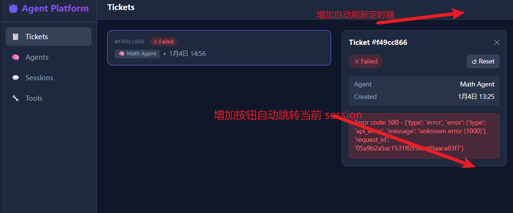

# prd 0.0.2

## user story

- Ticket 界面上增加两个功能：
    - Ticket 页面上支持自动刷新，默认是 5s 刷新
    - 打开 Ticket 后，增加 session 按钮，可以跳转当前 session 的页面
    
- Ticket 增加一个创建 ticket 的表单。表单内容根据 ticket 的 schema 来定

## 技术优化
- executor.py 当前使用的是 anthropic 的 API，这个代码比较，定义 Tool，MCP 等能力不方便
```
       import anthropic

        # 初始化 Anthropic 客户端
        client = anthropic.Anthropic()
```
- 创建 executor2.py，使用 claude_agent_sdk 来实现. 官方文档如右侧： https://console.anthropic.com/docs/en/agent-sdk/overview

```
import asyncio
from claude_agent_sdk import query, ClaudeAgentOptions

async def main():
    async for message in query(
        prompt="Find all TODO comments and create a summary",
        options=ClaudeAgentOptions(allowed_tools=["Read", "Glob", "Grep"])
    ):
        if hasattr(message, "result"):
            print(message.result)

asyncio.run(main())
```

- 在实现功能前，增加单元测试，来巩固输出的代码质量。