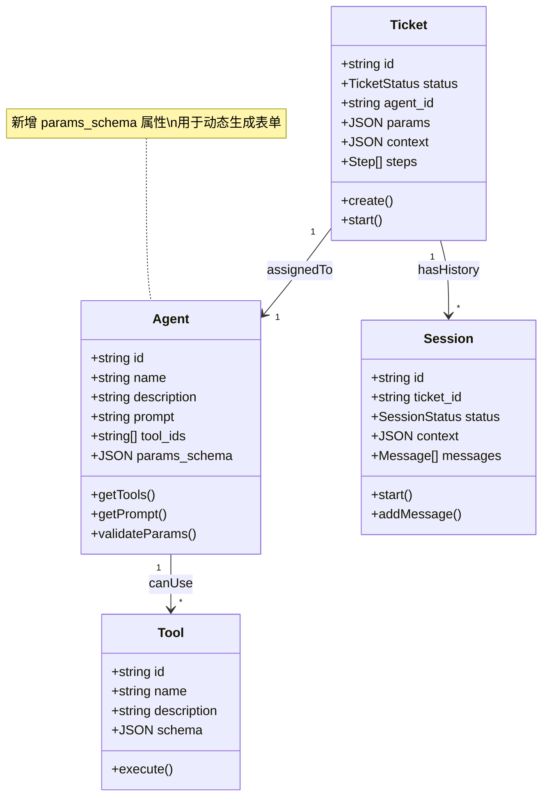

# Agent 平台领域模型分析 (v0.0.2 增量)

> 本文档是对 `prd/0.0.1/w1_concept_crystallizer_20260104133756.md` 的增量更新，仅描述 0.0.2 版本引入的变更。

---

## 1. Concept Dictionary

| Term | CN | Definition | 变更类型 |
|------|----|------------|---------|
| ParamsSchema | 参数模式 | Agent 定义的入参 JSON Schema，用于动态生成 Ticket 创建表单 | **新增** |
| Executor | 执行器 | 负责调用 LLM 执行 Agent 任务的组件，处理工具调用和系统工具 | 已有(技术优化) |
| claude_agent_sdk | Claude Agent SDK | Anthropic 官方 Python SDK，支持构建自主 AI Agent，内置文件、命令、搜索等工具 | **技术选型** |

---

## 2. Core Concepts

### 2.1 Agent (代理) - 属性扩展

> 基于 0.0.1 版本的 Agent 定义，新增 `params_schema` 属性。

- **Type**: Entity
- **Properties** (变更):
  - `id`: string
  - `name`: string
  - `description`: string
  - `prompt`: string (系统提示词)
  - `tool_ids`: string[] (可用工具列表)
  - **`params_schema`**: JSON Schema (**新增**，定义 Ticket.params 的结构)
- **Behaviors**: getTools(), getPrompt(), **validateParams()**
- **States**: (none)

#### params_schema 示例

```json
{
  "type": "object",
  "properties": {
    "target_url": {
      "type": "string",
      "description": "要分析的目标 URL",
      "format": "uri"
    },
    "analysis_depth": {
      "type": "integer",
      "description": "分析深度(1-5)",
      "minimum": 1,
      "maximum": 5,
      "default": 3
    }
  },
  "required": ["target_url"]
}
```

---

### 2.2 Executor (执行器) - 技术重构

> 这是一个技术层面的组件，不属于核心领域模型，但会影响系统行为。

**现状 (executor.py)**:
- 使用 `anthropic` 原生 API
- 手动管理消息历史和工具调用
- 系统工具定义硬编码

**目标 (executor2.py)**:
- 使用 `claude_agent_sdk`
- 两种交互模式：
  - `query()`: 无状态函数，适合一次性查询
  - `ClaudeSDKClient`: 有状态客户端，支持多轮对话
- 内置工具集成：Read, Write, Edit, Bash, Glob, Grep, WebSearch, WebFetch
- 自定义工具使用 `@tool` 装饰器

---

## 3. Class Diagram



---

## 4. Cognitive Dimensionality Reduction

> **核心概念数量**: 4 (Ticket, Agent, Session, Tool)

> ✅ 概念数量维持在认知极限内，0.0.2 版本仅对 Agent 进行属性扩展，未引入新的核心概念。

**变更影响分析**:

| 变更项 | 影响范围 | 复杂度 |
|--------|----------|--------|
| Agent.params_schema | 后端 Agent 模型 + 前端表单渲染 | 中 |
| Ticket 自动刷新 | 纯前端，无模型变化 | 低 |
| Ticket → Session 跳转 | 纯前端，无模型变化 | 低 |
| Executor 重构 | 后端技术层，无模型变化 | 高 |

---

## 5. Design Decisions

以下设计决策已在头脑风暴中确认：

### 5.1 params_schema 存储

- **决策**: 存储在数据库 `agents` 表的新字段
- **理由**: 与 Agent 其他属性保持一致，便于管理和查询

### 5.2 Executor 架构

- **决策**: `executor.py` 和 `executor2.py` 两者并存
- **实现策略**: 先对已有代码进行抽象，提取公共逻辑，差异只在调用的 SDK 上
- **理由**: 渐进式迁移，降低风险，便于对比测试

### 5.3 单元测试范围

- **决策**: 覆盖整个 Executor 模块
- **范围**: 包括现有 `executor.py` 和新增 `executor2.py`
- **理由**: 确保重构不破坏现有功能，提高代码质量

---

## 6. Open Questions

~~- [ ] `params_schema` 的存储位置？~~
~~- [ ] `params_schema` 是否需要版本控制？~~
~~- [ ] `executor2.py` 是否完全替代 `executor.py`？~~
~~- [ ] 单元测试的覆盖范围？~~

✅ 所有问题已解决，见 Section 5: Design Decisions

---

## 7. 前端变更摘要 (非领域模型)

以下变更不涉及领域模型变化，仅为 UI/UX 优化：

### 6.1 Ticket 列表自动刷新
- **实现**: 前端使用 `setInterval` 或 React Query 的 `refetchInterval`
- **默认间隔**: 5 秒
- **位置**: Ticket 列表页面

### 6.2 Ticket → Session 跳转按钮
- **位置**: Ticket 详情页面
- **行为**: 跳转到关联的最新 Session 页面
- **前提**: Ticket 必须有关联的 Session

---

## 8. 技术优化摘要

### 7.1 claude_agent_sdk 迁移

| 特性 | 现有 anthropic API | claude_agent_sdk |
|------|---------------------|------------------|
| 消息管理 | 手动构建 | 自动管理 |
| 工具定义 | JSON Schema 硬编码 | `@tool` 装饰器 |
| 内置工具 | 无 | Read, Write, Edit, Bash, Glob, Grep, WebSearch, WebFetch |
| 状态管理 | 手动 | ClaudeSDKClient 自动管理 |
| 异步支持 | 需手动处理 | 基于 anyio，原生支持 asyncio |

### 7.2 单元测试策略

建议测试覆盖：
- Executor 核心逻辑（工具调用、系统工具处理）
- Agent.validateParams() 参数校验
- 前端表单动态渲染（可选，E2E 测试）
