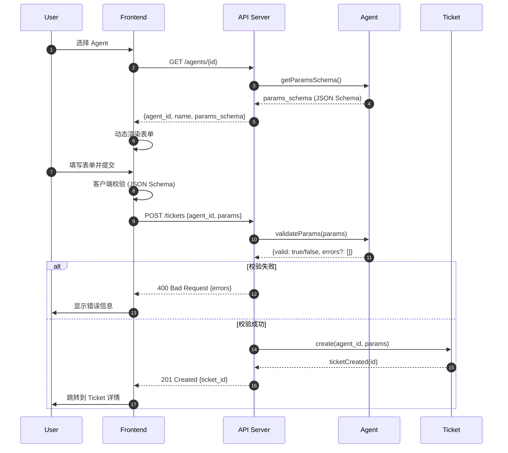
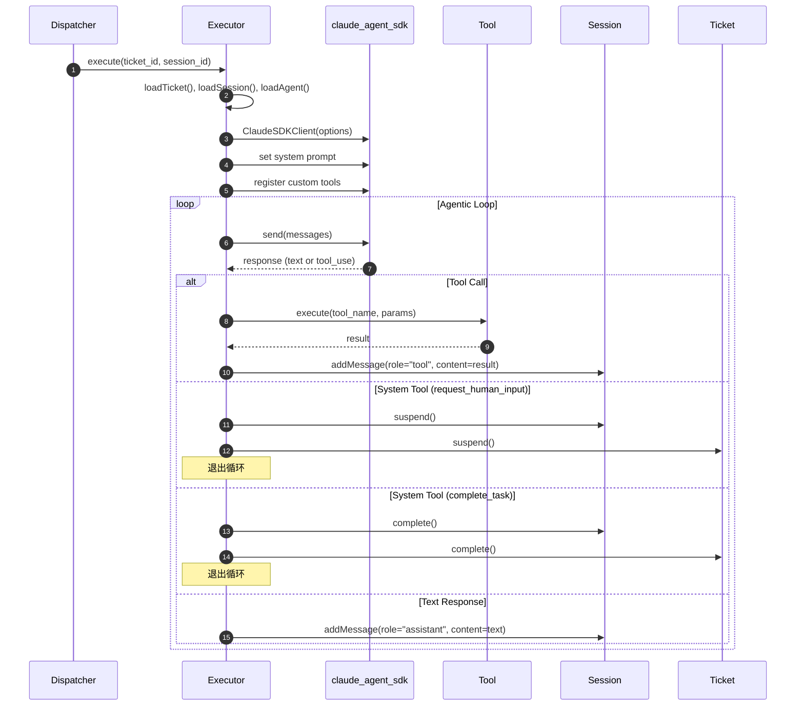
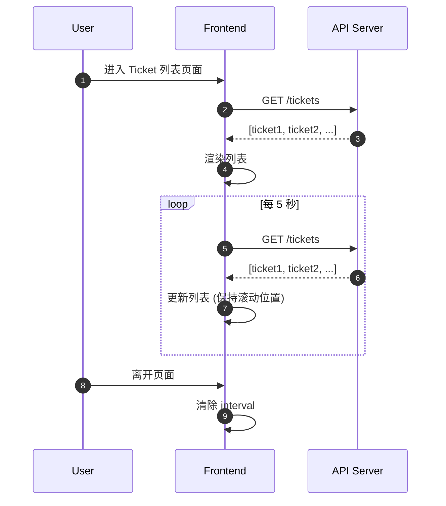
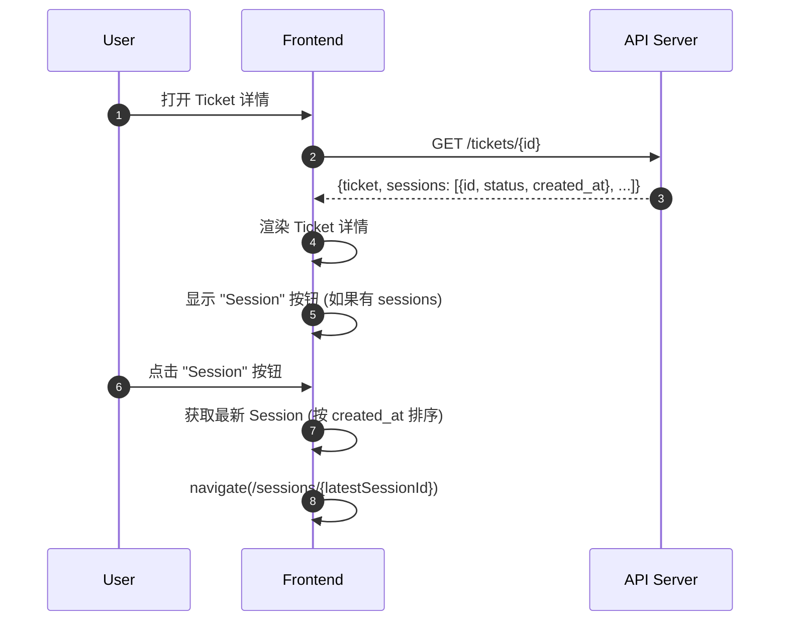

# Agent 平台逻辑审计报告 (v0.0.2 增量)

> 本文档是对 `prd/0.0.1/w2_logic_auditor_20260104142548.md` 的增量更新，仅审计 0.0.2 版本新增的场景和功能。

---

## 1. Scenario Extraction

| # | Scenario | Entities Involved | Key Actions | 类型 |
|---|----------|-------------------|-------------|------|
| 8 | 用户创建 Ticket（带动态表单） | User, Agent, Ticket | getParamsSchema(), validateParams(), create() | **新增** |
| 9 | Executor 使用 claude_agent_sdk 执行任务 | Executor, Agent, Session, Tool | query(), handleToolCall() | **新增** |
| 10 | 前端 Ticket 列表自动刷新 | Frontend, API | fetchTickets() (interval) | **新增** |
| 11 | 前端跳转到当前 Session | Frontend, Ticket, Session | getLatestSession(), navigate() | **新增** |

> **新增场景数量**: 4

---

## 2. Sequence Diagrams

### Scenario 8: 用户创建 Ticket（带动态表单）

**Observations**:
- ✅ 双重校验（前端 + 后端）确保数据有效性
- ⚠️ 缺失：Agent 的 `params_schema` 何时创建/更新？需要 CRUD API 支持
- ⚠️ 缺失：如果 `params_schema` 为空/null，表单如何处理？

---

### Scenario 9: Executor 使用 claude_agent_sdk 执行任务

**Observations**:
- ✅ 使用 `ClaudeSDKClient` 有状态客户端，符合多轮对话需求
- ⚠️ 设计决策：executor.py 和 executor2.py 并存，需要抽象公共逻辑
- ⚠️ 缺失：两个 Executor 如何选择？配置切换？还是根据 Agent 属性决定？

---

### Scenario 10: 前端 Ticket 列表自动刷新

**Observations**:
- ✅ 纯前端实现，无后端变更
- ⚠️ UX 优化：刷新时应保持滚动位置和选中状态
- ⚠️ 性能优化：考虑使用 Last-Modified / ETag 减少不必要的数据传输

---

### Scenario 11: 前端跳转到当前 Session

**Observations**:
- ✅ 简洁的导航逻辑
- ⚠️ 缺失：如果 Ticket 没有任何 Session（从未被执行），按钮如何处理？
- ⚠️ 缺失：API 是否返回关联的 sessions 列表？还是需要额外查询？

---

## 3. Gap Analysis Report

### Summary

| Severity | Count | Description |
|----------|-------|-------------|
| 🟠 Major | 2 | 关键流程中的职责不清 |
| 🟡 Minor | 4 | 边界情况处理或优化建议 |
| 🔵 Info | 1 | 需要澄清的问题 |

---

### 🟠 Major Issues

#### GAP-010: Executor 选择策略未定义

- **Scenario**: Scenario 9
- **Problem**: 设计决策确认 `executor.py` 和 `executor2.py` 两者并存，但未定义选择策略
- **Impact**: 调度器不知道该使用哪个 Executor
- **Suggested Fix**: 
  - 方案 A: 全局配置切换（环境变量或配置文件）
  - 方案 B: Agent 属性指定（如 `agent.executor_type = "sdk" | "anthropic"`）
  - 方案 C: 统一接口，运行时注入（推荐，符合抽象策略）

#### GAP-011: params_schema 管理 API 缺失

- **Scenario**: Scenario 8
- **Problem**: Agent 的 `params_schema` 需要 CRUD 支持，但 W1 只定义了存储位置
- **Impact**: 无法创建或更新 Agent 的参数模式
- **Suggested Fix**: 
  - Agent API 扩展：PUT /agents/{id} 支持更新 params_schema
  - 管理界面：Agent 详情页添加 schema 编辑器

---

### 🟡 Minor Issues

#### GAP-012: params_schema 为空时的表单处理

- **Scenario**: Scenario 8
- **Problem**: 如果 Agent 未定义 params_schema，前端如何渲染表单？
- **Suggested Fix**: 
  - 显示通用 JSON 输入框（自由格式）
  - 或者禁止创建 Ticket，提示管理员先配置 schema

#### GAP-013: Ticket 无 Session 时的按钮状态

- **Scenario**: Scenario 11
- **Problem**: 从未执行的 Ticket 没有 Session，此时 Session 按钮应该如何显示？
- **Suggested Fix**: 
  - 禁用按钮并显示 tooltip "尚无执行记录"
  - 或者隐藏按钮

#### GAP-014: 自动刷新的 UX 优化

- **Scenario**: Scenario 10
- **Problem**: 刷新时可能打断用户操作（如滚动、选中）
- **Suggested Fix**: 
  - 保持滚动位置
  - 保持行选中状态
  - 显示 "上次更新时间"

#### GAP-015: Ticket API 是否返回 sessions 列表

- **Scenario**: Scenario 11
- **Problem**: 当前 API 设计未明确是否在 GET /tickets/{id} 中 embed sessions
- **Suggested Fix**: 
  - 方案 A: embed sessions（简化前端请求）
  - 方案 B: 单独接口 GET /tickets/{id}/sessions（按需加载）

---

### 🔵 Info / Questions

- **Q3**: Executor 抽象策略确认 - 是使用接口/基类继承，还是策略模式注入？

---

## 4. Refinement Suggestions

> 以下建议应更新到 W1 领域模型或技术设计中。

### For Agent (代理)

| Change | Type | Rationale |
|--------|------|-----------|
| 添加 `executor_type: enum ("anthropic" | "sdk")` | New Property (Optional) | GAP-010: 支持 Executor 选择 |

### For Executor (技术组件)

| Change | Type | Rationale |
|--------|------|-----------|
| 定义 `IExecutor` 接口 | New Interface | GAP-010: 抽象公共行为 |
| `AnthropicExecutor`, `SDKExecutor` 实现接口 | Refactor | 复用公共逻辑，差异化 SDK 调用 |

### For API

| Change | Type | Rationale |
|--------|------|-----------|
| PUT /agents/{id} 支持 params_schema 更新 | Modify API | GAP-011 |
| GET /tickets/{id} embed sessions 列表 | Modify API Response | GAP-015 |

### For Frontend

| Change | Type | Rationale |
|--------|------|-----------|
| params_schema 为空时显示通用 JSON 输入 | Edge Case Handling | GAP-012 |
| Session 按钮在无 Session 时禁用 | Edge Case Handling | GAP-013 |
| 刷新时保持滚动和选中状态 | UX Optimization | GAP-014 |

---

## 5. Verification Checklist

| # | Scenario | Test Case | Expected Outcome |
|---|----------|-----------|------------------|
| 11 | 创建 Ticket (动态表单) | 选择有 params_schema 的 Agent | 前端渲染对应表单字段 |
| 12 | 创建 Ticket (动态表单) | 填写不符合 schema 的值 | 前端/后端返回校验错误 |
| 13 | 创建 Ticket (动态表单) | Agent 无 params_schema | 显示通用 JSON 输入或提示配置 |
| 14 | Executor 选择 | 配置使用 SDK Executor | Ticket 使用 executor2.py 执行 |
| 15 | Executor 选择 | 配置使用 Anthropic Executor | Ticket 使用 executor.py 执行 |
| 16 | 自动刷新 | 进入 Ticket 列表，等待 5 秒 | 列表自动更新，保持滚动位置 |
| 17 | Session 跳转 | 打开有 Session 的 Ticket | Session 按钮可点击，跳转成功 |
| 18 | Session 跳转 | 打开无 Session 的 Ticket | Session 按钮禁用或隐藏 |

---

## 6. Design Decisions

以下决策已在审计过程中确认：

### 6.1 Executor 选择策略 (GAP-010)

- **决策**: 方案 C - 统一接口，运行时注入
- **实现**: 
  - 定义 `IExecutor` 抽象接口
  - `AnthropicExecutor` 和 `SDKExecutor` 实现该接口
  - 通过依赖注入或工厂模式切换实现
- **理由**: 最大程度复用代码，符合开闭原则

### 6.2 Ticket API Sessions 返回 (GAP-015)

- **决策**: 方案 A - embed sessions
- **实现**: GET /tickets/{id} 返回体包含 `sessions: [{id, status, created_at}, ...]`
- **理由**: 简化前端请求，减少 API 调用次数

---

## 7. Open Questions

~~- [ ] Q3: Executor 抽象策略确认~~
~~- [ ] GAP-010: Executor 选择策略~~
~~- [ ] GAP-015: Ticket API 是否 embed sessions~~

✅ 所有问题已解决，见 Section 6: Design Decisions
