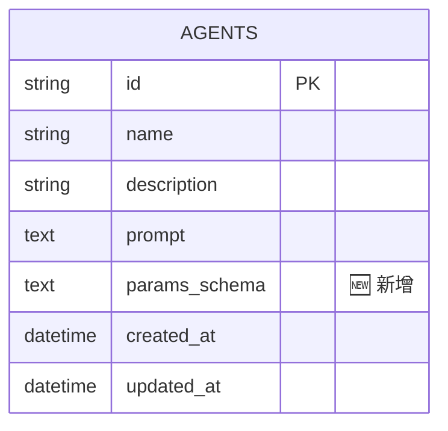

# Agent 平台 Schema Architect 分析 (v0.0.2 增量)

> 本文档是对 `prd/0.0.1/w3_schema_architect_20260104153356.md` 的增量更新，仅描述 0.0.2 版本引入的 schema 和 API 变更。

---

## 1. Technology Stack (无变更)

延续 0.0.1 版本技术选型：
- **Database**: SQLite 3
- **API Style**: REST (OpenAPI 3.0)
- **Serialization**: ISO 8601 日期, UUID v4

---

## 2. Database Schema Changes

### 2.1 ER Diagram (变更部分)



### 2.2 Migration Script

```sql
-- ============================================================
-- Migration: 0.0.2 - Add params_schema to agents
-- ============================================================

-- 添加 params_schema 字段到 agents 表
ALTER TABLE agents ADD COLUMN params_schema TEXT;

-- 说明：
-- - params_schema 存储 JSON Schema 格式的参数定义
-- - 允许为 NULL（向后兼容，旧 Agent 无需 schema）
-- - 前端读取 NULL 时显示通用 JSON 输入框
```

### 2.3 Model Changes

#### agents 表变更

| Column | Type | Nullable | Default | Description | 变更类型 |
|--------|------|----------|---------|-------------|---------|
| params_schema | TEXT | Yes | NULL | JSON Schema 格式的参数定义 | **新增** |

---

## 3. API Specification Changes

### 3.1 Endpoints Overview (变更部分)

| Method | Path | Description | 变更类型 |
|--------|------|-------------|---------|
| GET | /api/agents/{id} | 返回新增 paramsSchema 字段 | **修改** |
| PUT | /api/agents/{id} | 支持更新 paramsSchema | **修改** |
| GET | /api/tickets/{id} | 返回新增 sessions 列表 | **修改** |

### 3.2 Schema Changes (OpenAPI)

#### AgentResponse (修改)

```yaml
AgentResponse:
  type: object
  properties:
    id:
      type: string
      format: uuid
    name:
      type: string
    description:
      type: string
    prompt:
      type: string
    paramsSchema:                    # 🆕 新增
      type: object
      nullable: true
      description: |
        JSON Schema 定义 Ticket.params 的结构。
        前端根据此 schema 动态渲染创建 Ticket 的表单。
        如果为 null，前端显示通用 JSON 输入框。
    toolIds:
      type: array
      items:
        type: string
        format: uuid
    createdAt:
      type: string
      format: date-time
    updatedAt:
      type: string
      format: date-time
  required: [id, name, prompt, toolIds, createdAt, updatedAt]
```

#### UpdateAgentRequest (修改)

```yaml
UpdateAgentRequest:
  type: object
  properties:
    name:
      type: string
      minLength: 1
      maxLength: 100
    description:
      type: string
    prompt:
      type: string
      minLength: 1
    paramsSchema:                    # 🆕 新增
      type: object
      nullable: true
      description: 更新 Agent 的参数 schema
    toolIds:
      type: array
      items:
        type: string
        format: uuid
```

#### TicketResponse (修改)

```yaml
TicketResponse:
  type: object
  properties:
    # ... 现有字段保持不变 ...
    sessions:                        # 🆕 新增 (GAP-015 决策)
      type: array
      description: 关联的 Session 列表（按 created_at 降序）
      items:
        $ref: '#/components/schemas/SessionSummary'
    # ... 其余字段 ...
  required: [id, agentId, status, steps, sessions, createdAt, updatedAt]
```

#### SessionSummary (新增 - 用于 embed)

```yaml
SessionSummary:
  type: object
  properties:
    id:
      type: string
      format: uuid
    status:
      $ref: '#/components/schemas/SessionStatus'
    createdAt:
      type: string
      format: date-time
  required: [id, status, createdAt]
```

---

## 4. Backend Code Changes

### 4.1 Model 变更

#### `backend/app/models/agent.py`

```python
# 新增字段
params_schema: Mapped[str | None] = mapped_column(Text, nullable=True)
```

### 4.2 Schema 变更

#### `backend/app/schemas/agent.py`

```python
from typing import Any, Dict

class AgentResponse(BaseModel):
    # ... 现有字段 ...
    params_schema: Optional[Dict[str, Any]] = None  # 🆕 新增
    
class UpdateAgentRequest(BaseModel):
    # ... 现有字段 ...
    params_schema: Optional[Dict[str, Any]] = None  # 🆕 新增
```

#### `backend/app/schemas/ticket.py`

```python
from app.schemas.session import SessionSummary

class TicketResponse(BaseModel):
    # ... 现有字段 ...
    sessions: List[SessionSummary] = Field(default_factory=list)  # 🆕 新增
```

### 4.3 Executor 抽象 (新增)

根据 W2 决策 (GAP-010)，采用统一接口运行时注入：

#### `backend/app/scheduler/base_executor.py` (新增)

```python
from abc import ABC, abstractmethod

class IExecutor(ABC):
    """Executor 抽象接口"""
    
    def __init__(self, ticket_id: str, session_id: str):
        self.ticket_id = ticket_id
        self.session_id = session_id
    
    @abstractmethod
    async def run(self) -> None:
        """执行任务主循环"""
        pass
    
    @abstractmethod
    async def _execute_tool(self, tool_name: str, tool_input: dict) -> dict:
        """执行工具"""
        pass
```

#### `backend/app/scheduler/executor.py` (重构)

```python
from app.scheduler.base_executor import IExecutor

class AnthropicExecutor(IExecutor):
    """使用 Anthropic 原生 API 的 Executor"""
    # 现有代码重构到此类
```

#### `backend/app/scheduler/executor2.py` (新增)

```python
from app.scheduler.base_executor import IExecutor

class SDKExecutor(IExecutor):
    """使用 claude_agent_sdk 的 Executor"""
    # 新实现
```

#### `backend/app/scheduler/executor_factory.py` (新增)

```python
from app.scheduler.base_executor import IExecutor
from app.scheduler.executor import AnthropicExecutor
from app.scheduler.executor2 import SDKExecutor

def create_executor(executor_type: str, ticket_id: str, session_id: str) -> IExecutor:
    """工厂方法创建 Executor 实例"""
    if executor_type == "sdk":
        return SDKExecutor(ticket_id, session_id)
    else:
        return AnthropicExecutor(ticket_id, session_id)
```

---

## 5. Frontend Changes

### 5.1 Ticket 自动刷新

```typescript
// frontend/src/pages/TicketsPage.tsx
const REFRESH_INTERVAL = 5000; // 5 seconds

useEffect(() => {
  const interval = setInterval(() => {
    refetch(); // React Query refetch
  }, REFRESH_INTERVAL);
  
  return () => clearInterval(interval);
}, [refetch]);
```

### 5.2 动态表单渲染

```typescript
// frontend/src/components/DynamicForm.tsx
import { JsonForms } from '@jsonforms/react';

interface Props {
  schema: object | null;
  data: object;
  onChange: (data: object) => void;
}

const DynamicForm: React.FC<Props> = ({ schema, data, onChange }) => {
  if (!schema) {
    // 无 schema 时显示 JSON 编辑器
    return <JsonEditor value={data} onChange={onChange} />;
  }
  
  return (
    <JsonForms
      schema={schema}
      data={data}
      onChange={({ data }) => onChange(data)}
    />
  );
};
```

### 5.3 Session 跳转按钮

```typescript
// frontend/src/pages/TicketDetailPage.tsx
const latestSession = ticket.sessions[0]; // 按 created_at 降序

<Button
  disabled={!latestSession}
  onClick={() => navigate(`/sessions/${latestSession?.id}`)}
>
  Session
</Button>
```

---

## 6. Summary

### 变更清单

| 类别 | 变更项 | 类型 |
|------|--------|------|
| **Database** | agents.params_schema | 新增字段 |
| **API** | AgentResponse.paramsSchema | 新增字段 |
| **API** | UpdateAgentRequest.paramsSchema | 新增字段 |
| **API** | TicketResponse.sessions | 新增字段 |
| **Backend** | IExecutor 接口 | 新增 |
| **Backend** | AnthropicExecutor | 重构 |
| **Backend** | SDKExecutor | 新增 |
| **Backend** | ExecutorFactory | 新增 |
| **Frontend** | Ticket 列表自动刷新 | 新增 |
| **Frontend** | 动态表单组件 | 新增 |
| **Frontend** | Session 跳转按钮 | 新增 |

### 依赖项

| 依赖 | 用途 |
|------|------|
| claude-agent-sdk | SDKExecutor 实现 |
| @jsonforms/react | 前端动态表单渲染 |
