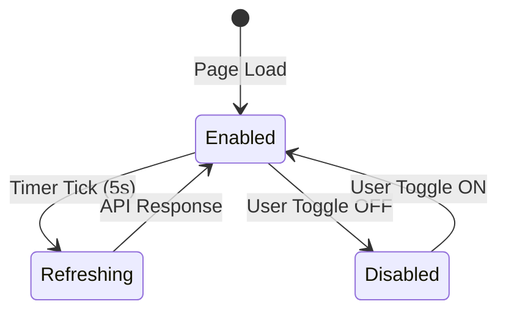
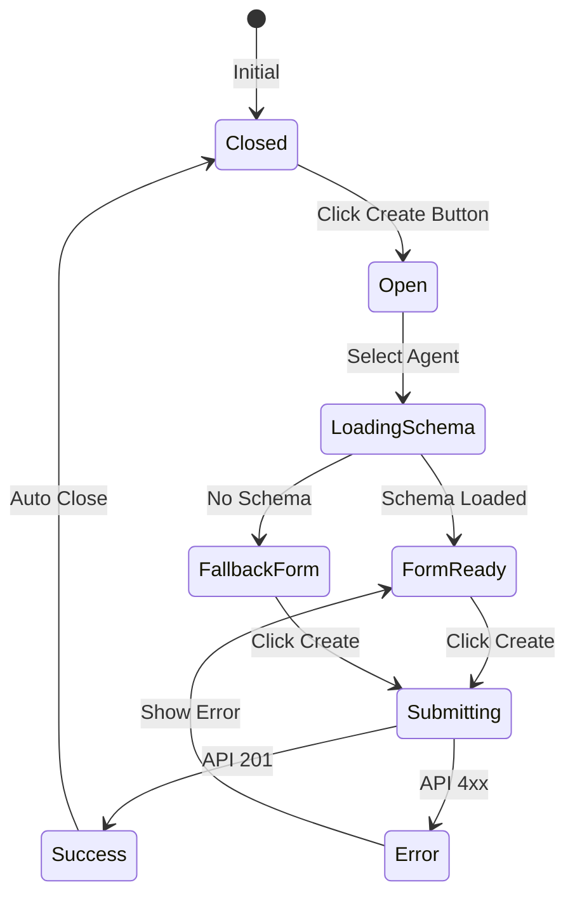

# Agent 平台 UI Simulator 原型 (v0.0.2 增量)

> 本文档是对 `prd/0.0.1/w4_ui_simulator_20260104160210.md` 的增量更新，仅描述 0.0.2 版本新增的 UI 组件和交互。

---

## 1. UI Changes Summary

| 变更项 | 位置 | 类型 |
|--------|------|------|
| 自动刷新控件 | Ticket 列表页 | **新增** |
| Session 跳转按钮 | Ticket 详情面板 | **新增** |
| 创建 Ticket 按钮 | Ticket 列表页 | **新增** |
| 创建 Ticket 弹窗 | Ticket 列表页 | **新增** |
| 动态表单组件 | 创建 Ticket 弹窗 | **新增** |

---

## 2. UI Component Breakdown (新增)

### 2.1 自动刷新控件

| 属性 | 描述 |
|------|------|
| 位置 | Ticket 列表页右上角 |
| 默认状态 | 开启，5 秒间隔 |
| 交互 | Toggle 开关 + 倒计时显示 |

```
┌─────────────────────────────────────────────────────┐
│ Tickets                          🔄 Auto: 5s ◉ ON  │
├─────────────────────────────────────────────────────┤
│  [Ticket List...]                                   │
└─────────────────────────────────────────────────────┘
```

### 2.2 Session 跳转按钮

| 属性 | 描述 |
|------|------|
| 位置 | Ticket 详情面板，按钮组内 |
| 条件 | 仅当 Ticket 有关联 Session 时显示 |
| 行为 | 点击跳转到最新 Session 详情页 |

```
┌─────────────────────────────────────────┐
│ Ticket #abc12345         ✕              │
├─────────────────────────────────────────┤
│ ● Suspended                             │
│                                         │
│ [Session] [Resume] [Reset]   ← 新增按钮 │
│                                         │
└─────────────────────────────────────────┘
```

### 2.3 创建 Ticket 按钮 + 弹窗

| 属性 | 描述 |
|------|------|
| 位置 | Ticket 列表页右上角 |
| 交互 | 点击打开创建弹窗 |

```
┌─────────────────────────────────────────────────────┐
│ Tickets              [+ Create Ticket] 🔄 5s ◉     │
├─────────────────────────────────────────────────────┤
```

### 2.4 动态表单组件

根据 Agent 的 `params_schema` 动态渲染表单字段。

| Schema 类型 | 渲染组件 |
|-------------|----------|
| `string` | Text Input |
| `integer` | Number Input |
| `boolean` | Toggle / Checkbox |
| `array` | Multi-value Input |
| `object` | Nested Form |
| (无 schema) | JSON Text Area |

---

## 3. Wireframes

### 3.1 Ticket 列表页 (更新)

```
┌─────────────────────────────────────────────────────────────────┐
│ 🎫 Tickets                                                       │
│                                                                   │
│ ┌─────────────────────────────────────────────────────────────┐ │
│ │ [+ Create Ticket]        Auto Refresh: [5s ▼] [◉ ON]       │ │
│ └─────────────────────────────────────────────────────────────┘ │
│                                                                   │
│ ┌─────────────────────────────────────────────────────────────┐ │
│ │ #abc12345  ● RUNNING                                        │ │
│ │ 🧠 Code Assistant  •  Jan 4, 23:40                          │ │
│ └─────────────────────────────────────────────────────────────┘ │
│                                                                   │
│ ┌─────────────────────────────────────────────────────────────┐ │
│ │ #def67890  ● SUSPENDED                                      │ │
│ │ 🧠 Data Analyst  •  Jan 4, 23:35                            │ │
│ └─────────────────────────────────────────────────────────────┘ │
└─────────────────────────────────────────────────────────────────┘
```

### 3.2 Ticket 详情面板 (更新)

```
┌─────────────────────────────────────────┐
│ Ticket #abc12345                     ✕ │
├─────────────────────────────────────────┤
│ ● SUSPENDED              [▸ Session]   │  ← 新增 Session 按钮
│                          [▶ Resume]    │
│                          [↺ Reset]     │
├─────────────────────────────────────────┤
│ Agent:       Code Assistant             │
│ Created:     Jan 4, 23:40               │
├─────────────────────────────────────────┤
│ Steps:                                  │
│   ● completed  分析代码                 │
│   ● running    生成报告                 │
├─────────────────────────────────────────┤
│ Context:                                │
│ ┌─────────────────────────────────────┐│
│ │ { "target": "/src/main.py" }        ││
│ └─────────────────────────────────────┘│
└─────────────────────────────────────────┘
```

### 3.3 创建 Ticket 弹窗

```
┌─────────────────────────────────────────────────────┐
│ Create Ticket                                    ✕ │
├─────────────────────────────────────────────────────┤
│                                                     │
│ Agent: [Code Assistant ▼]                           │
│                                                     │
│ ─────────────────────────────────────────────────── │
│ Parameters (根据 Agent Schema 动态生成)            │
│ ─────────────────────────────────────────────────── │
│                                                     │
│ Target Path *                                       │
│ ┌─────────────────────────────────────────────────┐│
│ │ /home/user/project                              ││
│ └─────────────────────────────────────────────────┘│
│                                                     │
│ Analysis Depth                                      │
│ ┌─────────────────────────────────────────────────┐│
│ │ 3                                    [1 - 5]    ││
│ └─────────────────────────────────────────────────┘│
│                                                     │
│ Context (选填)                                      │
│ ┌─────────────────────────────────────────────────┐│
│ │ { "goal": "Find bugs" }                         ││
│ └─────────────────────────────────────────────────┘│
│                                                     │
│ ─────────────────────────────────────────────────── │
│                                                     │
│                    [Cancel]  [Create Ticket]        │
│                                                     │
└─────────────────────────────────────────────────────┘
```

### 3.4 无 Schema 时的表单

当 Agent 没有定义 `params_schema` 时：

```
┌─────────────────────────────────────────────────────┐
│ Create Ticket                                    ✕ │
├─────────────────────────────────────────────────────┤
│                                                     │
│ Agent: [Legacy Agent ▼]                             │
│                                                     │
│ ⚠️ This agent doesn't have a params schema.        │
│    Please enter raw JSON.                           │
│                                                     │
│ Parameters (JSON)                                   │
│ ┌─────────────────────────────────────────────────┐│
│ │ {                                               ││
│ │   "key": "value"                                ││
│ │ }                                               ││
│ └─────────────────────────────────────────────────┘│
│                                                     │
│                    [Cancel]  [Create Ticket]        │
│                                                     │
└─────────────────────────────────────────────────────┘
```

---

## 4. State Transitions (新增)

### Auto Refresh Flow



### Create Ticket Flow



---

## 5. UI State Table (新增)

| View | Condition | UI State | Available Actions |
|------|-----------|----------|-------------------|
| Ticket List | Auto refresh ON | 显示倒计时 | Toggle OFF, Pause on hover |
| Ticket List | Auto refresh OFF | 显示刷新按钮 | Toggle ON, Manual refresh |
| Ticket Detail | Has sessions | Session 按钮可点击 | Navigate to Session |
| Ticket Detail | No sessions | Session 按钮禁用 | None |
| Create Modal | Agent selected | 动态表单显示 | Fill form, Submit |
| Create Modal | No schema | JSON 输入框 | Enter JSON, Submit |

---

## 6. Component Implementation

### 6.1 AutoRefreshControl.jsx

```jsx
// frontend/src/components/AutoRefreshControl.jsx

import { useState, useEffect } from 'react';

export default function AutoRefreshControl({ 
  enabled, 
  interval = 5000, 
  onRefresh 
}) {
  const [countdown, setCountdown] = useState(interval / 1000);
  const [isEnabled, setIsEnabled] = useState(enabled);
  
  useEffect(() => {
    if (!isEnabled) return;
    
    const timer = setInterval(() => {
      setCountdown(prev => {
        if (prev <= 1) {
          onRefresh();
          return interval / 1000;
        }
        return prev - 1;
      });
    }, 1000);
    
    return () => clearInterval(timer);
  }, [isEnabled, interval, onRefresh]);
  
  return (
    <div className="flex items-center gap-2 text-sm">
      <span className="text-slate-400">Auto:</span>
      {isEnabled && (
        <span className="text-indigo-400 font-mono">{countdown}s</span>
      )}
      <button
        onClick={() => setIsEnabled(!isEnabled)}
        className={`px-2 py-1 rounded ${
          isEnabled 
            ? 'bg-indigo-600 text-white' 
            : 'bg-slate-700 text-slate-400'
        }`}
      >
        {isEnabled ? 'ON' : 'OFF'}
      </button>
    </div>
  );
}
```

### 6.2 CreateTicketModal.jsx

```jsx
// frontend/src/components/CreateTicketModal.jsx

import { useState, useEffect } from 'react';
import { api } from '../api/client';
import DynamicForm from './DynamicForm';

export default function CreateTicketModal({ isOpen, onClose, onCreated }) {
  const [agents, setAgents] = useState([]);
  const [selectedAgentId, setSelectedAgentId] = useState('');
  const [selectedAgent, setSelectedAgent] = useState(null);
  const [params, setParams] = useState({});
  const [context, setContext] = useState('');
  const [loading, setLoading] = useState(false);
  const [error, setError] = useState(null);
  
  useEffect(() => {
    if (isOpen) {
      api.listAgents().then(setAgents);
    }
  }, [isOpen]);
  
  useEffect(() => {
    if (selectedAgentId) {
      api.getAgent(selectedAgentId).then(setSelectedAgent);
    }
  }, [selectedAgentId]);
  
  const handleSubmit = async () => {
    setLoading(true);
    setError(null);
    
    try {
      await api.createTicket({
        agent_id: selectedAgentId,
        params,
        context: context ? JSON.parse(context) : null,
      });
      onCreated();
      onClose();
    } catch (err) {
      setError(err.message);
    } finally {
      setLoading(false);
    }
  };
  
  if (!isOpen) return null;
  
  return (
    <div className="fixed inset-0 bg-black/50 flex items-center justify-center z-50">
      <div className="bg-slate-800 rounded-xl border border-slate-700 w-full max-w-lg p-6">
        <div className="flex justify-between items-center mb-4">
          <h2 className="text-lg font-semibold">Create Ticket</h2>
          <button onClick={onClose} className="text-slate-400 hover:text-white">✕</button>
        </div>
        
        {/* Agent Select */}
        <div className="mb-4">
          <label className="block text-sm text-slate-400 mb-1">Agent</label>
          <select
            value={selectedAgentId}
            onChange={e => setSelectedAgentId(e.target.value)}
            className="w-full bg-slate-900 border border-slate-600 rounded px-3 py-2"
          >
            <option value="">Select an Agent</option>
            {agents.map(a => (
              <option key={a.id} value={a.id}>{a.name}</option>
            ))}
          </select>
        </div>
        
        {/* Dynamic Form */}
        {selectedAgent && (
          <div className="mb-4">
            <label className="block text-sm text-slate-400 mb-1">Parameters</label>
            <DynamicForm
              schema={selectedAgent.params_schema}
              value={params}
              onChange={setParams}
            />
          </div>
        )}
        
        {/* Context */}
        <div className="mb-4">
          <label className="block text-sm text-slate-400 mb-1">Context (JSON, optional)</label>
          <textarea
            value={context}
            onChange={e => setContext(e.target.value)}
            className="w-full bg-slate-900 border border-slate-600 rounded px-3 py-2 h-24 font-mono text-sm"
            placeholder='{"goal": "..."}'
          />
        </div>
        
        {error && (
          <div className="mb-4 p-3 bg-red-500/20 border border-red-500/30 rounded text-red-400 text-sm">
            {error}
          </div>
        )}
        
        <div className="flex justify-end gap-2">
          <button onClick={onClose} className="px-4 py-2 bg-slate-700 rounded hover:bg-slate-600">
            Cancel
          </button>
          <button
            onClick={handleSubmit}
            disabled={!selectedAgentId || loading}
            className="px-4 py-2 bg-indigo-600 rounded hover:bg-indigo-500 disabled:opacity-50"
          >
            {loading ? 'Creating...' : 'Create Ticket'}
          </button>
        </div>
      </div>
    </div>
  );
}
```

### 6.3 DynamicForm.jsx

```jsx
// frontend/src/components/DynamicForm.jsx

export default function DynamicForm({ schema, value, onChange }) {
  // 无 schema 时显示 JSON 输入框
  if (!schema || !schema.properties) {
    return (
      <div>
        <div className="text-amber-400 text-sm mb-2">
          ⚠️ No schema defined. Enter raw JSON.
        </div>
        <textarea
          value={typeof value === 'string' ? value : JSON.stringify(value, null, 2)}
          onChange={e => {
            try {
              onChange(JSON.parse(e.target.value));
            } catch {
              onChange(e.target.value);
            }
          }}
          className="w-full bg-slate-900 border border-slate-600 rounded px-3 py-2 h-32 font-mono text-sm"
        />
      </div>
    );
  }
  
  // 有 schema 时动态渲染表单
  return (
    <div className="space-y-3">
      {Object.entries(schema.properties).map(([key, prop]) => (
        <div key={key}>
          <label className="block text-sm text-slate-300 mb-1">
            {key} {schema.required?.includes(key) && <span className="text-red-400">*</span>}
          </label>
          {renderField(prop, value[key], v => onChange({ ...value, [key]: v }))}
        </div>
      ))}
    </div>
  );
}

function renderField(prop, value, onChange) {
  switch (prop.type) {
    case 'string':
      return (
        <input
          type="text"
          value={value || ''}
          onChange={e => onChange(e.target.value)}
          className="w-full bg-slate-900 border border-slate-600 rounded px-3 py-2 text-sm"
          placeholder={prop.description}
        />
      );
    case 'integer':
    case 'number':
      return (
        <input
          type="number"
          value={value ?? prop.default ?? ''}
          onChange={e => onChange(Number(e.target.value))}
          min={prop.minimum}
          max={prop.maximum}
          className="w-full bg-slate-900 border border-slate-600 rounded px-3 py-2 text-sm"
        />
      );
    case 'boolean':
      return (
        <label className="flex items-center gap-2">
          <input
            type="checkbox"
            checked={value ?? false}
            onChange={e => onChange(e.target.checked)}
            className="w-4 h-4"
          />
          <span className="text-sm text-slate-400">{prop.description}</span>
        </label>
      );
    default:
      return (
        <textarea
          value={typeof value === 'string' ? value : JSON.stringify(value, null, 2)}
          onChange={e => {
            try { onChange(JSON.parse(e.target.value)); } 
            catch { onChange(e.target.value); }
          }}
          className="w-full bg-slate-900 border border-slate-600 rounded px-3 py-2 h-20 font-mono text-sm"
        />
      );
  }
}
```

---

## 7. Verification Checklist

### 自动刷新
- [ ] 页面加载后自动开始刷新
- [ ] 倒计时显示正确
- [ ] Toggle OFF 后停止刷新
- [ ] Toggle ON 后恢复刷新
- [ ] 刷新时保持滚动位置
- [ ] 刷新时保持选中状态

### Session 跳转
- [ ] 有 Session 时按钮可点击
- [ ] 无 Session 时按钮禁用并显示 tooltip
- [ ] 点击跳转到正确的 Session 页面

### 创建 Ticket
- [ ] 点击按钮打开弹窗
- [ ] Agent 下拉列表正确加载
- [ ] 选择 Agent 后动态渲染表单
- [ ] 无 schema 时显示 JSON 输入框
- [ ] 必填字段验证
- [ ] 创建成功后关闭弹窗并刷新列表
- [ ] 创建失败显示错误信息
