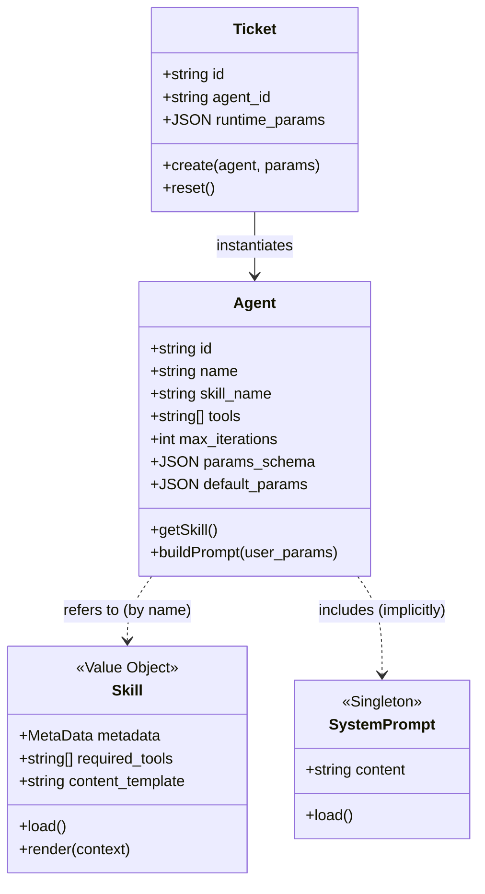

# Agent 平台领域模型分析 (v0.0.3 增量)

> 本文档是对 `prd/0.0.2/w1_concept_crystallizer_20260104231000.md` 的增量更新，聚焦于 Skill 抽象引入及 Agent/Ticket 能力增强。

---

## 1. Concept Dictionary

| Term | CN | Definition | 变更类型 |
|------|----|------------|---------|
| Skill | 技能 | 定义工作流程和所需工具的模板文件 (Markdown)，作为 Agent 的核心逻辑载体 | **新增** |
| Agent | 代理 | 在 v0.0.3 中升级为具备 Skill 引用、参数配置及生命周期管理的智能体配置实体 | 修改 (核心增强) |
| System Prompt | 系统提示词 | 全局定义的系统级提示词文件，影响所有 Agent 的基础行为 | **新增** |
| Ticket | 工单 | 实例化任务，v0.0.3 中增加了基于 Agent 参数模式的动态表单填充及 Reset 能力 | 修改 (流程优化) |

---

## 2. Core Concepts

### 2.1 Skill (技能)

> 文件系统中的 Markdown 文件，定义了 Agent 的"灵魂"（Prompt 模板 + 工具声明）。

- **Type**: Value Object (File-based)
- **Properties**:
  - `name`: string (Metadata)
  - `description`: string (Metadata)
  - `tools`: string[] (声明该 Skill 依赖的工具列表)
  - `content`: string (Markdown 正文，即 Prompt 模板)
- **Behaviors**: `loadFromFile()`, `render(params)`
- **States**: (Stateless)

### 2.2 Agent (代理)

> Agent 现在不仅是工具的集合，更是 Skill 的具体化配置实例。

- **Type**: Entity
- **Properties** (变更):
  - ... (保留 v0.0.2 属性: id, name, description)
  - **`skill_name`**: string (引用 `prompt/skill/{name}.md`，**取代** 原 `prompt` 字段?)
  - **`max_iterations`**: integer (新增，最大执行轮数)
  - **`params`**: dictionary (新增，对应 v0.0.2 的 `params_schema` 实例化默认值?) *注: US 2.7 提到指定 Agent 的 param*
  - `tools`: string[] (覆写或继承 Skill 定义的工具?)
  - `params_schema`: JSON Schema (保留，用于前端渲染填参表单)
- **Behaviors**: 
  - `loadSkill()`: 读取关联的 Skill 文件
  - `compilePrompt(ticket_params)`: 
      - 逻辑: **合并策略** (`System Prompt` + `Skill.content` + `Agent.prompt`)。
      - 顺序: 系统通用指令 -> 技能基础指令 -> Agent个性化指令，共同构成 System Message。
  - `getEffectiveTools()`: 
      - 逻辑: 返回 `Set(Agent.tools) U Set(Skill.tools)` 的并集
- **States**: (none)

### 2.3 System Prompt (系统提示词)

> 全局单例配置。

- **Type**: Value Object (File-based)
- **Properties**: 
  - `content`: string (来自 `prompt/system_prompt.md`)
- **Behaviors**: `load()`

---

## 3. Class Diagram

---

## 4. Cognitive Dimensionality Reduction

> **Total concepts identified**: 5 (Agent, Skill, Ticket, Tool, SystemPrompt)

> ⚠️ Concept count (5) slightly exceeds limit (4). 
> **Reduction Strategy:**
> 1.  Treat **SystemPrompt** as a global configuration detail, not a core domain object interactively manipulated.
> 2.  **Skill** is closely tied to Agent. It can be viewed as the "Static Definition" vs Agent "Runtime Config".
> 
> **Core 4:**
> 1.  **Agent** (The Configured Entity)
> 2.  **Skill** (The Capability Template)
> 3.  **Ticket** (The Execution Instance)
> 4.  **Tool** (The Atomic Capability)

---

## 5. Open Questions

- [x] **Ambiguous**: `Agent.tools` vs `Skill.tools`: **Resolution**: 使用并集 (`Agent.tools ∪ Skill.tools`)。Agent 配置可以补充 Skill 中未定义的额外工具。
- [x] **Unclear**: `Agent.prompt` (US 2.6) vs `Skill.md` content. **Resolution**: **合并策略**。`Skill.content` 作为基础能力定义，`Agent.prompt` 作为个性化指令，两者合并（连同 `System Prompt`）共同构成最终的 System Message。
- [x] **Technical**: "Tools ID is Name" (US 3.4). **Resolution**: `Tool` 实体保留 UUID 主键，但在 Agent/Skill 引用及查找工具时，**统一使用 Tool Name** 作为标识符。
- [x] **Missing**: Where is `System Prompt` used? **Resolution**: 在 Agent 开始推理 (Reasoning) 时注入到 Context 中。

---

## 6. Constraints & Tech Notes

- **Skill Storage**: Filesystem (`backend/prompt/skill/*.md`).
- **Template Engine**: Jinja2 (for Skill/Agent prompt rendering).
- **Tool ID**: Migration to use Name string as identifier.
