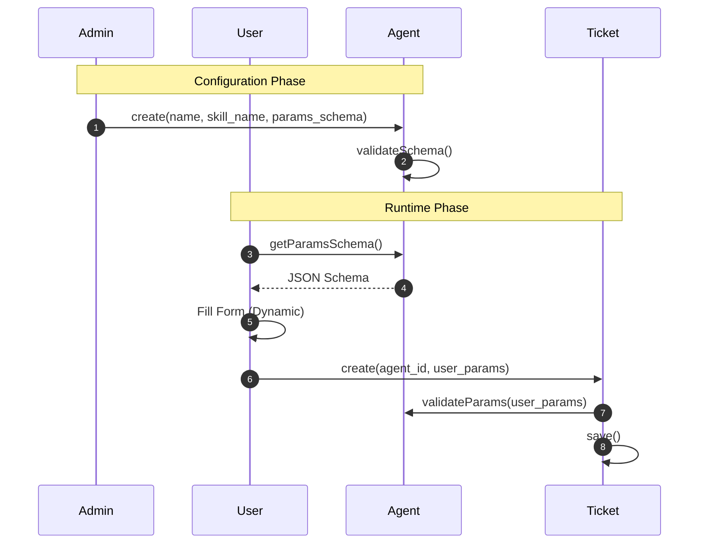
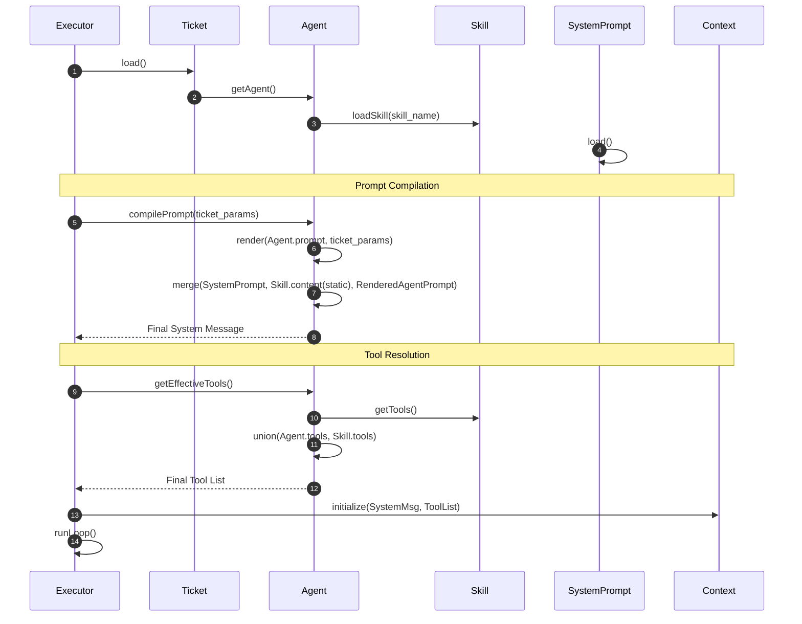

# Logic Auditor Analysis (PRD 0.0.3)

> This document validates the domain model from `w1_concept_crystallizer_20260107225700.md` against requirements in `userstory.md`.

## 1. Scenario Extraction

| # | Scenario | Entities Involved | Key Actions |
|---|----------|-------------------|-------------|
| 1 | Define Skill | Skill (File) | Author creates `SKILL.md` with tools & prompt template |
| 2 | Configure Agent | Agent, Skill | Admin links Agent to Skill, defines `params_schema` & `default_params` |
| 3 | Create Ticket | User, Ticket, Agent | User selects Agent, fills params (validated by schema), submits Ticket |
| 4 | Execute Ticket | Ticket, Executor, Agent, Skill, SystemPrompt | System loads Agent/Skill, merges prompts, injects params, runs loop |
| 5 | Reset Ticket | Ticket | User clears steps, restarts execution with same params |

> **Total scenarios identified**: 5

---

## 2. Sequence Diagrams

### Scenario 2 & 3: Configure Agent & Create Ticket

**Observations**:
- **Critical Dependency**: `Agent.params_schema` MUST align with variables used in `Skill.content` (Jinja2 template). If Skill uses `{{ url }}` but Agent schema doesn't define `url`, execution will fail. The model doesn't enforce this check at configuration time.

### Scenario 4: Execute Ticket (The Merge Strategy)

**Observations**:
- **Ambiguity Resolved**: The "Merge Strategy" and "Tool Union" work well in sequence.
- **Missing**: How does `Executor` handle `max_iterations`? W1 added this to Agent, but Executor logic needs to check it.

---

## 3. Gap Analysis Report

### Summary

| Severity | Count | Description |
|----------|-------|-------------|
| 🔴 Critical | 1 | Schema/Template mismatch risk |
| 🟠 Major | 1 | `max_iterations` enforcement location |
| 🟡 Minor | 1 | Tool ID resolution details |

---

### 🔴 Critical Issues

#### GAP-001: No Validation between Agent Prompt and Params Schema

- **Scenario**: Configure Agent
- **Problem**: `Agent.prompt` is a Jinja2 template expecting specific variables. `Agent.params_schema` defines the shape of input data. If they don't match, `render()` fails at runtime.
- **Impact**: Runtime errors during Ticket execution.
- **Suggested Fix**: Validation logic to ensure `Agent.params_schema` covers all variables used in `Agent.prompt`. (Note: Skill content is static, so no validation needed there).

---

### 🟠 Major Issues

#### GAP-002: Execution Loop Termination Logic

- **Scenario**: Execute Ticket
- **Problem**: `Agent` has `max_iterations`. `Ticket` is the running instance. Who enforces the limit?
- **Impact**: Potential infinite loops or ignored config.
- **Suggested Fix**: 
    - `Executor` must read `Agent.max_iterations`.
    - **OR** `Ticket` copies `max_iterations` from Agent upon creation (snapshotting config).

---

### 🟡 Minor Issues

#### GAP-003: Ticket Reset Semantics

- **Scenario**: Reset Ticket
- **Problem**: US 3.1 says "Clear steps, restart". Does it allow changing params?
- **Impact**: UX confusion.
- **Suggested Fix**: Explicitly define `Ticket.reset()` as "Clear Steps, Keep Params, Set Status=Pending". New params require New Ticket.

---

## 4. Refinement Suggestions

### For Agent

| Change | Type | Rationale |
|--------|------|-----------|
| Add `validateTemplateCompatibility()` | New Behavior | GAP-001: Check if `params_schema` satisfies `Skill` template variables. |

### For Executor

| Change | Type | Rationale |
|--------|------|-----------|
| Logic: Enforce `max_iterations` | Logic Update | GAP-002: Use Agent's config to limit loop. |

### For Tool

| Change | Type | Rationale |
|--------|------|-----------|
| ID Strategy | Confirmation | Use `name` as logical key, map to `id` (UUID) internally if needed, or fully migrate to String ID. |

---

## 5. Verification Checklist

| # | Scenario | Test Case | Expected Outcome |
|---|----------|-----------|------------------|
| 1 | Agent Config | Create Agent with schema missing a variable used in Skill | Warning or Error: "Template variable 'x' not found in schema" |
| 2 | Tool Union | Skill has [T1], Agent has [T2] | Executor receives [T1, T2] |
| 3 | Prompt Merge | System[A], Skill[B], Agent[C] | Final Prompt regex match `A.*B.*C` |
| 4 | Max Iterations | Agent.max_iter=3 | Loop stops after 3 turns even if task not done |
| 5 | Ticket Reset | Reset running ticket | Steps empty, Status=Pending, Params unchanged |
