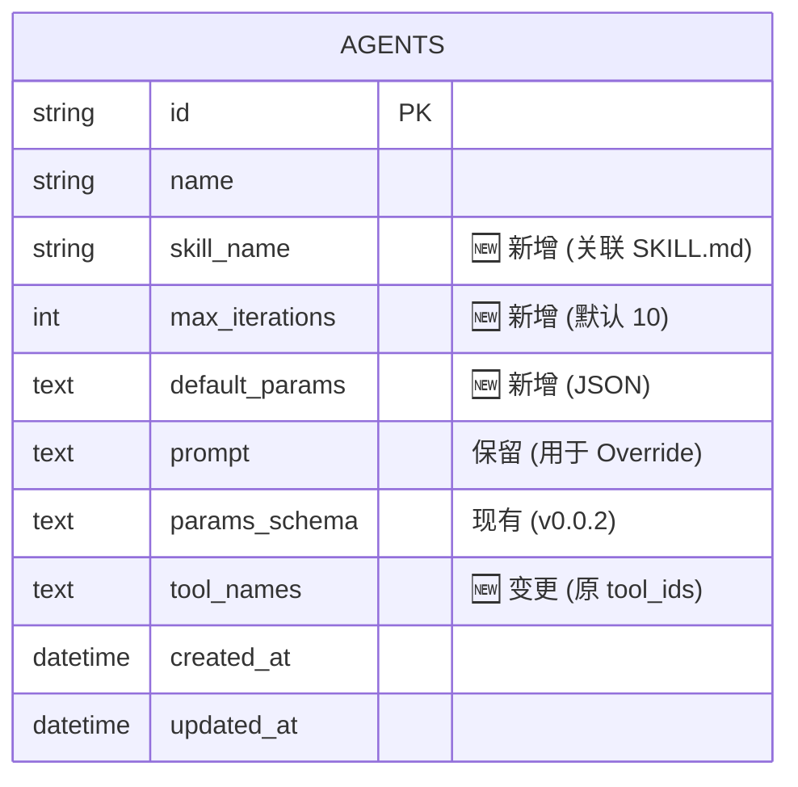

# Agent 平台 Schema Architect 分析 (v0.0.3 增量)

> 本文档是对 `prd/0.0.2/w3_schema_architect_20260104232500.md` 的增量更新，基于 PRD 0.0.3 需求定义技术架构变更。

---

## 1. Technology Stack (无变更)

- **Database**: SQLite 3
- **API Style**: REST (OpenAPI 3.0)
- **Serialization**: ISO 8601, UUID v4

---

## 2. Database Schema Changes

### 2.1 ER Diagram (变更部分)



### 2.2 Migration Script

```sql
-- ============================================================
-- Migration: 0.0.3 - Agent Enhancements
-- ============================================================

-- 1. Add new columns to agents table
ALTER TABLE agents ADD COLUMN skill_name TEXT;
ALTER TABLE agents ADD COLUMN max_iterations INTEGER DEFAULT 10;
ALTER TABLE agents ADD COLUMN default_params TEXT; -- JSON string
ALTER TABLE agents ADD COLUMN tool_names TEXT; -- JSON array of strings (Tool Names)

-- Note: Existing 'tool_ids' column implies UUIDs. 
-- Migration Strategy: 
-- 1. Keep 'tool_ids' for backward compatibility OR 
-- 2. Rename/Replace with 'tool_names' if 'id' is no longer UUID.
-- Decision: Add 'tool_names' and mark 'tool_ids' as deprecated.
```

---

## 3. API Specification Changes

### 3.1 Endpoints Overview

| Method | Path | Description | 变更类型 |
|--------|------|-------------|---------|
| GET | /api/skills | 列出所有可用 Skill (文件名列表) | **新增** |
| GET | /api/skills/{name} | 获取特定 Skill 详情 (Content, meta) | **新增** |
| GET | /api/prompts/system | 获取 System Prompt 内容 | **新增** |

### 3.2 Schema Changes (OpenAPI)

#### AgentResponse (修改)

```yaml
AgentResponse:
  type: object
  properties:
    # ... 现有字段 ...
    skillName:                    # 🆕 新增
      type: string
      description: 关联的 Skill 文件名 (e.g. "data_analyst")
    maxIterations:                # 🆕 新增
      type: integer
      default: 10
    defaultParams:                # 🆕 新增
      type: object
      description: Agent 预设参数，用于填充 Ticket 创建时的初始值
    toolNames:                    # 🆕 新增
      type: array
      items:
        type: string
  # ...
```

#### TicketCreateRequest (验证)

Schema 保持不变，但 Params 验证逻辑需增强：
1. 合并 Defaults: `FinalParams = Agent.defaultParams + UserInput`
2. 验证 Schema: **严格校验**。使用 Python `jsonschema` 库验证 `FinalParams` 是否符合 `Agent.paramsSchema`。
   - 如果验证失败，抛出 `422 Unprocessable Entity` 错误，并返回详细的 Schema 错误信息。

---

## 4. Backend Code Changes

### 4.1 Model 变更

#### `backend/app/models/agent.py`

```python
skill_name: Mapped[str | None] = mapped_column(Text, nullable=True)
max_iterations: Mapped[int] = mapped_column(Integer, default=10)
default_params: Mapped[str | None] = mapped_column(Text, nullable=True) # Stored as JSON
tool_names: Mapped[str | None] = mapped_column(Text, nullable=True) # Stored as JSON list
```

### 4.2 Executor Logic Update (CRITICAL)

#### `backend/app/scheduler/executor_logic.py`

根据 **Concept Crystallizer** 和 **Logic Auditor** 的结论，Executor 需要实现复杂的 Prompt 编译逻辑：

```python
async def compile_system_message(agent: Agent, skill_content: str, system_prompt: str, params: dict) -> str:
    """
    Merge Strategy:
    1. System Prompt (Global)
    2. Skill Content (Base Template)
    3. Agent Prompt (Override/Customization, rendered with params)
    """
    rendered_agent_prompt = jinja2.render(agent.prompt, **params)
    
    # Simple Concatenation or complex framing?
    # Decision: Concatenate with logical separators
    return f"""
    {system_prompt}
    
    --- Skill Definition ---
    {skill_content}
    
    --- Specific Instructions ---
    {rendered_agent_prompt}
    """
```

#### `backend/app/services/skill_loader.py` (新增)

- 负责扫描 `backend/prompt/skill/*.md`
- 解析 FrontMatter (YAML) 获取 `name`, `description`, `tools`
- 提供 `list_skills()` 和 `get_skill(name)` 接口

### 4.3 Validation Logic (新增)

#### `backend/app/services/ticket_service.py`

```python
import jsonschema
from fastapi import HTTPException

def validate_ticket_params(agent: Agent, user_params: dict) -> dict:
    # 1. Merge Defaults
    default_params = json.loads(agent.default_params or '{}')
    final_params = {**default_params, **user_params}
    
    # 2. Validate against Schema
    if agent.params_schema:
        schema = json.loads(agent.params_schema)
        try:
            jsonschema.validate(instance=final_params, schema=schema)
        except jsonschema.ValidationError as e:
            raise HTTPException(status_code=422, detail=f"Params validation failed: {e.message}")
            
    return final_params
```

### 4.4 Tool ID Migration

- System Tools: Register by Name explicitly.
- User Tools (via MCP/etc?): Ensure `name` is unique and used for lookup.
- `Executor` calls `tool_registry.get_tool(name)`.

---

## 5. Frontend Changes

### 5.1 Agent Form Update

- **Skill Selection**: Dropdown list fetching from `GET /api/skills`.
- **Params Configuration**:
    - 允许管理员在 Agent 配置页面设置 `Default Params` (JSON Editor).
- **Tool Selection**:
    - 显示 `Skill` 定义的 "Required Tools" (Read-only or Highlighted).
    - 允许选择额外 Tools (Union Logic).

### 5.2 Ticket Creation Logic

- **Load Defaults**: 当用户选择 Agent 时，表单默认值填充为 `Agent.defaultParams`.

### 5.3 Skill Viewer (Optional)

- 简单的页面用于查看 Skill 内容 (`GET /api/skills/{name}`)，帮助用户理解 Agent 能力。

---

## 6. Summary

### 变更清单

| 类别 | 变更项 | 描述 |
|------|--------|------|
| **Database** | Agents Table | +skill_name, +max_iterations, +default_params, +tool_names |
| **API** | Skill API | /api/skills endpoints |
| **Backend** | SkillLoader | File reader for Markdown/YAML |
| **Backend** | Executor | Prompt Merge Logic & Tool Name Resolution |
| **Frontend** | Agent Form | Support new fields & Skill selection |

### 风险点

1. **Jinja 渲染错误**: 需确保 User Params 满足 Agent Prompt 的变量需求 (覆盖 Gap-001).
2. **Tool Name 冲突**: 目前假设 Tool Name 全局唯一.
