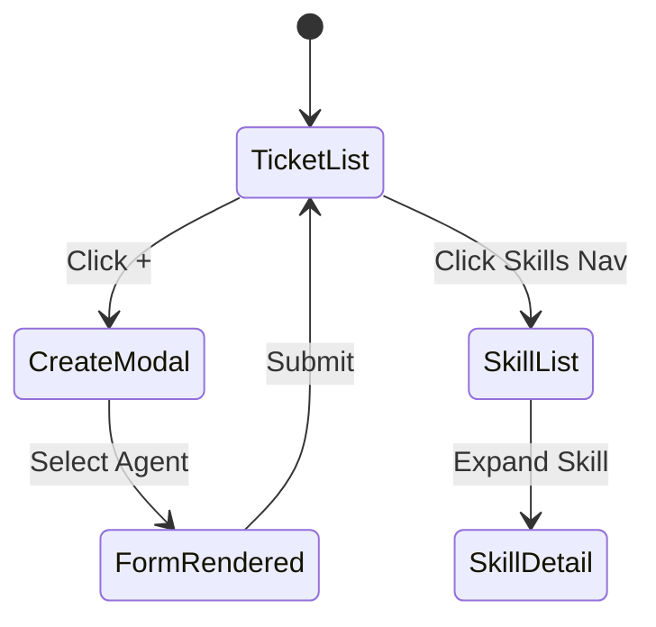

# Agent 平台 UI Simulator 分析 (v0.0.3)

> 本文档是对 `prd/0.0.2/w4_ui_simulator_20260104234100.md` 的增量更新，聚焦于 Skill 引入后的 UI 变更。

## 1. UI Component Breakdown

### 1.1 Skill Selection (Agent Creation)

| Feature | Description |
|---------|-------------|
| **Source** | `GET /api/skills` |
| **Display** | Dropdown list of Skill Names |
| **Interaction** | Selecting a skill auto-populates "Recommended Tools" in the tool selector (Visual hint) |

### 1.2 Dynamic Form Defaults (Ticket Creation)

| Feature | Description |
|---------|-------------|
| **Logic** | `FinalValue = UserInput || Agent.defaultParams || Schema.default` |
| **UI** | When Agent is selected, form fields pre-fill with `Agent.defaultParams` |

---

## 2. Directory Structure

```
prd/0.0.3/prototype/
├── index.html          # Main Entry
├── css/
│   └── style.css       # Styles
└── js/
    ├── mock-data.js    # v0.0.3 Data (Skills, Agents with defaults)
    └── app.js          # Interaction Logic
```

## 3. Prototype Files

(See generated files in `prototype/` directory)

### Key Interaction Flow: Ticket Creation

1. **User clicks "Create Ticket"** → Modal Opens.
2. **User selects "Security Auditor" Agent**.
3. **System looks up Agent**:
   - `params_schema`: `{ repository, branch, scan_depth }`
   - `default_params`: `{ repository: "...", branch: "main" }`
4. **UI Renders Form**:
   - `repository` input pre-filled.
   - `branch` input pre-filled with "main".
   - `scan_depth` input empty or schema default (1).

---

## 4. State Transitions



## 5. Verification Checklist

- [x] **Skill Data**: Mock data contains `skills` array.
- [x] **Agent Linking**: Agent object contains `skillName`.
- [x] **Defaults Merging**: Ticket creation form uses `defaultParams`.
- [x] **Visuals**: Tailwind CSS classes applied correctly.

---

> **Next Step**: Proceed to Implementation Planning.
